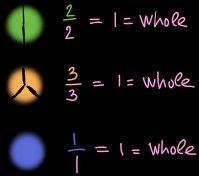
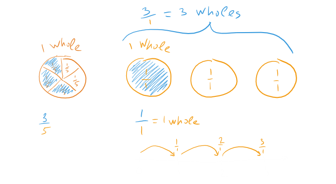

# Unit 4: Understand fractions

## Lesson 1: Fractions intro

### Intro to fractions

~~~
1 / 4 = 1/4

1 / 8 = 1/8
~~~

### Cutting shapes into equal parts

### Cut shapes into equal parts

## Lesson 2: What fractions mean

### Identifying numerators and denominators

Identifying numerators and denominators 3/4

### Understand numerators and denominators

### Recognize fractions

### Recognize fractions

### Recognizeing fractions greater than 1

### Recognize fractions greater than 1

## Quiz 1

## Lesson 3: Fractions on the number line

### Fractions on a number line

### Fraction on number line widget

### Fractions on the number line

### Finding 1 on the number line

### Find 1 on the number line

### Fractions greater than 1 on the number line

### Fractions greater than 1 on the number line

## Quiz 2

## Lesson 4: Fractions and whole numbers

### Representing 1 as a fraction

### Whole numbers as fraction

### Writing whole numbers as fractions

### Write whole numbers as fractions

## Lesson 5: Equivalent fractions

