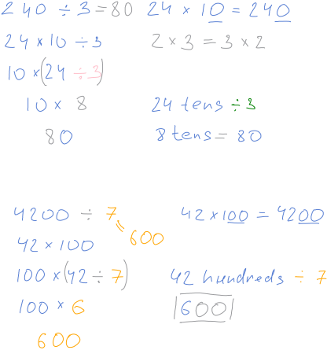

# Unit 8: Divide with remainders

## Lesson 1: Remainders

### Understanding remainders

### Introduction to remainders

### Interpret remainders

### Divide with remainders (2-digit by 1-digit)

## Quiz 1

## Lesson 2: Divide multiples of 10, 100, and 1,000 by 1-digit numbers

### Quotients that are multiples of 10

### Divide multiples of 10, 100, and 1,000 by 1-digit numbers

## Lesson 3: Division with place value

### Division using place value

### Divide using place value

## Lesson 4: Division with area models

### Division with area models

### Divide by 1-digit numbers with area models

## Quiz 2

## Lesson 5: Multi-digit division with partial quotients

### Introduction to division with partial quotients (no remainder)

### Division with partial quotients (remainder)

### Divide multi-digit numbers by 2, 3, 4, and 5 (remainders)

### Divide multi-digit numbers by 6, 7, 8, and 9 (remainders)

## Quiz 3

## Lesson 6: Multiplication and division word problems

### Division word problem: field goals

### Multiplication word problem: pizza

### Multiplication and division word problems

## Lesson 7: Multi-step word problems

### Multi-step word problems with whole numbers

## Quiz 4

## Unit test

