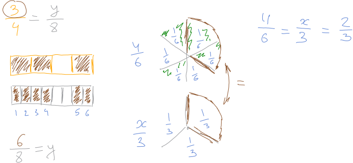
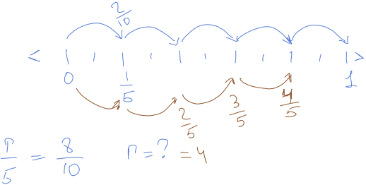
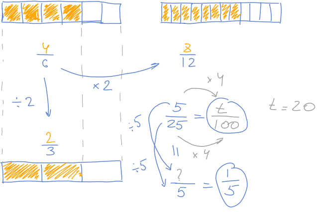
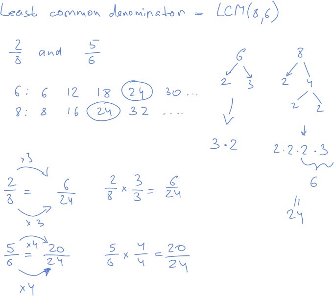

# Unit 9: Add and subtract fraction (like denominators)

## Lesson 1: Equivalent fractions

### Equivalent fractions with models

### Equivalent fractions (fraction models)

### Equivalent fractions on number lines

### Eqiovalent fractions (number lines)

### Visualizing equivalent fractions review

> Fractions are `equivalent` if they are equal or represent the same amount..

### Equivalent fractions

### More on equivalent fractions

### Equivalent fractions

## Lesson 2: Common denominators

### Finding common denominators

### Common denominators: 1/4 and 5/6

## Quiz 1

## Lesson 3: Decomposing fractions

### Decompose fractions visually

### Decomposing a fraction visually

### Decomposing a mixes number

### Decompose fractions

## Lesson 4: Adding and subtracting fractions with like denominators

### Adding frractions with like denominators

### Add fractions with common denominators

### Subtracting fractions with like denominators

### Subtract fractions with common denomiators

## Lesson 5: Adding and subtracting fractions: word problems

### Fraction word problem: piano

### Fraction word problem: pizza

### Fraction word problem: spider eyes

### Add and subtract fraction word problems (same denominator)

## Quiz 2

## Lesson 6: Mixed numbers

### Writing mixed numbers as improper fractions

### Writing improper fractions as mixed numbers

### Write mixed numbers and improper fractions

## Lesson 7: Adding and subtracting mixed numbers

### Adding mixed numbers with like denominators

### Subtracting mixed numbers with like denominators

### Add and subtract mixed numbers (no regrouping)

### Mixed number addition with regrouping

### Subtracting mixed numbers with regrouping

### Add and subtract mixed numbers (with regrouping)

## Quiz 3

## Unit Test

