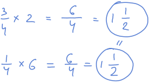

# Unit 10: Multiply fractions

## Lesson 1: Multiplying fractions and whole numbers visually

### Multiplying fractions and whole numbers visually

### Multiply fractions and whole numbers on the number line

## Lesson 2: Multiplying whole numbers and fractions

### Equivalent fraction and whole number multiplication problems

### Multiplying unit fractions and whole numbers

### Multiply unit fractions and whole numbers

### Multiply fractions and whole numbers

## Quiz 1

## Lesson 3: Multiplying whole number and mixed numbers

### Multiplying whole numbers by mixes numbers

### Multiply mixed numbers and whole numbers

## Lesson 4: Multiplying fractions and whole numbers word problems

### Multiplying fractions word problem: milk

### Multiplying fractions word problem: movies

### Multiplying fractions by whole numbers word problem

### Multiply fractions and whole numbers word problems

## Quiz 2

## Lesson 5: Multiplication as scaling

### Multiplication as scaling with fractions

### Fraction multiplication as scaling examples

### Fraction multiplication as scaling

## Lesson 6: Multiplying fractions and whole numbers

### Multiplying fractions by whole number on a number line

### Multiplying fractions and whole numbers visually

### Multiplying fractions and whole numbers

### Multiply fractions and whole numbers visually

## Lesson 7: Multiplying fractions

### Multiplying 2 fractions: fraction model

### Multiplying 2 fractions: number line

### Multiplying fractions with visuals

### Multiplying 2 fractions: 5/6 x 2/3

### Multiplying fractions

## Quiz 3

## Lesson 8: Multiplying mixed numbers

### Multiplying mixed numbers

### Multiply mixed numbers

## Lesson 9: Area of rectangles with fractional side lengths

### Finding area with fractional sides 1

### Finding area with fractional sides 2

### Area of rectangles with fraction side lengths

## Lesson 10: Multiplying fractions word problems

### Multiplying fractions word problem: muffins

### Multiplying fractions word problem: laundry

### Multiplying fractions word problem: bike

### Multiply fractions word problems

## Quiz 4

## Unit test

