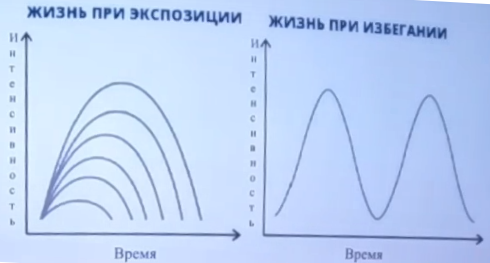
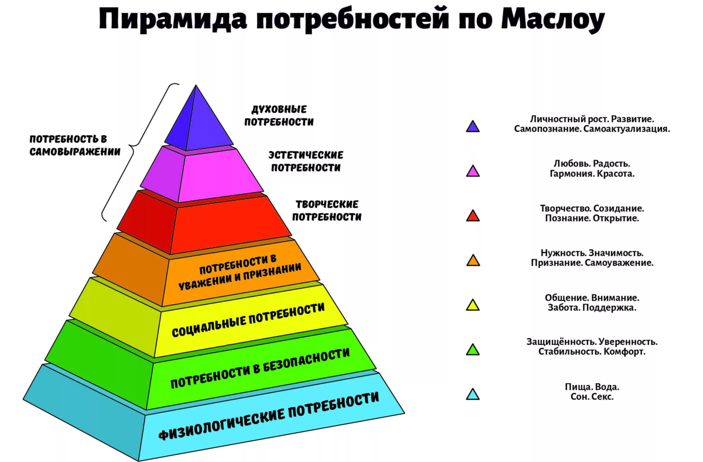

# Разбираемся вместе

## Вебинар - С чего начинаются близкие отношения или несколько слов о привязанности

[Ссылка на видео](https://vk.com/video/@dtsznmos?z=video-111898236_456240375%2Fclub111898236%2Fpl_-111898236_-2)

> Отношения младенца с матерью влияет на то, как мы выстраиваем отношения дальше.

## Тебя привязанности

### Материалы 

**Джон Боулби**

Что такое привязанность и как она устроена

Потребность в привязанности, это такая же **Самостоятельная** потребность как потребность в пище и т.д.

**Мери Эйнсворт**

Разработала систему определения **типа** пирвязанности

**Гай Фредерик Харлоу**

Теория любви

Пищевое поведение, является отдельным от портебности в комфорте и близости

Провел экспиримент, где было постоянное проявление заботы и отрывистое. Получилось много особей, которые не хотели заводить потомство.

> Очень важно, чтобы в нашей жизни была надежная фигура, которая будет удовлетворять потребность в близости.

> Важно, чтобы эта фигура не была хаотичной и отвергающей. Именно это оказывает влияние.

**Карл Хайнз Бриш**

Книга: Терапия нарушеня привязанности привязанности

Предлагал обучать пары в период беременности, каким образом можно сформировать у ребенка ощущение близости (надежной)

### Основные положения теории привязанности

> `Привязанность` имеет *самостоятельное* значение.

Особенно важными для формирования типа характера являются первые детские годы.

> Хорошие отношения младенца с мамой - Хорошие отношения близости в *будущем*.

> Многое зависит от того, с какой `Репрезентацией` привязанности фигуры вокруг ребёнка.

> `Исследовательское` поведение возможно если уже есть накопленный пул привязанности, тогда появляются силы на исследование.

Только хорошо выстроенные отношения являются залогом возможности движения во внешнем пространстве. Если нам есть куда вернутся, и подкрепится привязанностью, тогда мы идем во внешнюю среду.

> Для формирования привязаннося очень важной является `Чуткость`

### Типы привязанности

- Способствующие благополучию
  - Надежный тип привязанности
- Ненадежные
  - Ненадежная избегающая привязанность
  - Ненадежная эмбивалентная привязанность

> Надежный тип привязанности проявляет себя во взрослой жизни через понимание важности друг друга

> Ненадежно избегающий тип - Отдаление без причины. Зовешь, а они не приближаются. Обрвывание конфликта безразличием и холодностью. Проще замкнутся и держать все в себе.

> Нужно **рисковать**, и говорить ему о своих чувстах. Даже если партнер не выдержит, никто не умрет и все выдержат.

> Не нужно путать с равнодешием, отсутствием любви. Чтобы отличить, нужно разговаривать.

> Ненадежная эмбивалентная (Раскачивающаяся в разные стороны) привязанность - Например мама не может найти ребенка, а потом он появляется. Она ругается. Конфликты, типа ты не звонил или не приехал, я имею право тебя ругать. Нужно учиться управлять своими чувствами. Искать способы иного выражения чувств.

> Их не стоит путать с систематическим насилием (эмоциональным, физическим). 

### Итоги

1. Мы можем корректировать тип привязанности
2. Другие люди не являются копией нашей матери

## Вебинар - Способы совладания с тревожностью

[Ссылка на видео](https://vk.com/video-111898236_456240383)

### Вводная часть

> "В моей жизни было много поводов для беспокойства, большинство из которых так никогда и не случилось" 
> 
> *Марк Твен*

### Что такое тревога

`Тревога` - это эмоциональное переживание, обеспокоенность, при которой челове испытывает дискомфорт от *Непреодалимости* перспективы.

- `Адаптивная` (**Здоровая**) тревога - Требует решения проблемы здесь и сейчас
- `Дезадаптивная` (**Нездоровая**) - Длительная, Хроническая, Контрпродуктивная

### Эволюция тревоги

- Цель эволюции - выживание и репродукция, а не наше счастье
- Раньше она помогала выжить, но сейчас, жизнь стала **безопаснее**, а значит страхи **потеряли** свой **смысл**
- Сейчас причиной тревоги являются пугающие, гипотетические, дисфункцональные мысли о **Возможности** реальной угрозы и непереносимость неопределенности

Есть прямая связь с тем, какие были родители и что мы переживали в детстве:

> `Примеры реагирования родителей` + `жизненный опыт` = `чувствительность к угрозам`

### Маскировка и симптомы тревоги

Маскирока:

- ВСД (Вегето-Сосудистая Дистония)
- Остеохондроз
- Кардионевроз
- Синдром гипервентиляции
- СРК (Синдром Раздраженного Кишечника)
- Артериальная гипертензия

Симптомы:

- Головокружение (будто плывёт картина перед глазами)
- Гипервентиляция
- Тошнота
- Тяжесть в груди
- Потливость или озноб
- Тахикардия или "громкое" сердцебиение
- Страх смерти
- Страх сумасшествия

Рост тревоги:

1. Разпознать опасность
2. Катострафизировать
3. Контролировать ситуацию
4. Нзбегать

### Основные правила, формула тревоги

```
            Опасность        --> Переоценка
Тревога = -----------------
            Копинг|Ресурсы   --> Недооценка
```

Нет разницы, происходит ли событие в `реальности` или в `воображении`

> `Избегание` - Если человек считает, что вероятность наступления угрозы высока, а собственных сил (ресурсов) для ее преодаления не будет достаточно, то он будет всеми силами стараться избежать столкновения с ней

### Механизм и цикл возникновения тревоги

1. Триггер: Вижу самолет
2. Тревожное убеждение и образы: Самлет упадет. Я буду беспомощен и не смогу выжить
3. Поведенческая реакция: Избегание. Я не буду летать на самолёте (Никогда)
4. Убеждение об опасности и собственной неспособности не опровергается
5. см. п. 1

```
→   Триггер           →  Убеждение
       ↑                    ↓
    Нет опровержения  ←  Реакция 
```

### Практические рекомендации по снижению тревоги и интерактив

#### Техники работы с тревогой

Когнетивные:

- [Оспаривание мыслей](#оспаривание-мыслей)
- [Сократовский диалог](#сократовский-диалог)
- [Когнитивный континуум](#когнитивный-континуум)
- [Прогнозирование сценариев](#прогнозирование-сценариев)

Поведенческие:

- [Атака на стыд](#атака-на-стыд)
- [Экспозиция](#экспозиция)

Дыхательные:

- [Замедленное дыхание](#замедленное-дыхание)
- [Диафрагмальное дыхание](#диафрагмальное-дыхание)
- [Бумажный пакет](#бумажный-пакет)
- [Дыхание по квадрату](#дыхание-по-квадрату)

Дистракция:

- [Счет](#счет)
- [Воображение](#воображение)
- [Разговор](#разговор)

#### Оспаривание мыслей

`Виписать` тревожную мысть, и разобрать ее, используя следующие вопросы:

1. Каковы объективные доказательства?
2. Насколько вероятно, что плохое всетаки случится?
3. Что самое ХУДШЕЕ, что может случиться?
4. Что самое ЛУЧШЕЕ, что может случиться?
5. Что ВЕРОЯТНЕЕ ВСЕГО произойдет?

Примеры вопросов:

- Каковы объективные, конкретные доказательства, подтверждающие или опровергающие мои мысли?
- Насколько вероятно, что пложое все-таки случится? Как бы я справился с этим, если бы это случилось?
- Что самое ХУДШЕЕ, что может случитьмя? Что самое ЛУЧШЕЕ, что может случится? Что ВЕРОЯТНЕЕ ВСЕГО произойдет?
- Что бы подумал об этой ситуации беспристрастный, независимый наблюдатель?
- Чтобы я сказал другу, который думает и чувствует так же, как я? Что бы сказал мне мой лучший друг?
- Какие аспекты этой ситуации просто не в моей власти, как бы я не переживал по этому поводу? Каковы преимущества приятия факта, что это не в моей власти?
- Вместо того, чтобы беспокоиться, какие шаги я могу предпринять сейчас, чтобы предотвратить или справиться с проблемой, которая меня беспокоит?
- Что самое худшее, что может случиться? Насколько это было бы ужасно по сравнению с тем наихудшим, которое я когда-либо испытывал?
- Каковы преимущества и недостатки, что бы верить в это или беспокоится об этом?
- Есть ли альтернативные объяснения? Каковы доказательста этой альтернативы?
- Насколько значимы мои переживания? В какой степени мое будущее действительно зависит от этого?
- Насколько это будет важно для меня через неделю|месяц|полгода|год? Почему это измениться с течением времени?
- Если бы я был на его|её месте, каковы возможные причины, по которым я бы так поступил?
- Отражает ли это мнение всех остальных? Могут ли другие люди чувствовать себя иначе?
- Может это мои старые привычки? Как это влияет на мою реакцию на текущую ситуацию?
- Есть ли более конструктивный способ взглянуть на это?

#### Сократовский диалог

Мысль для оспаривания: ____________

1. Что подтверждает эту мысль? Что опровергает?
2. Моя мысль основывается на фактах или на чувствах?
3. Не "черно-белая" ли это мысль, не мыслю ли я крайностями, тогда как реальность на самом деле сложнее?
4. Делаю ли я предположения? Возможно ли, что я неправильно интерпретирую события?
5. Могут ли другие люди иметь иное объяснение этой ситуации? Какое бы оно было?
6. Рассматриваю ли я все факты или только поддерживающие мою точку зрения?
7. Возможно ли, что я преувеличиваю в данный момент времени?
8. Думаю ли я об этом только по привычке или у меня есть факты?
9. Поделился ли кто-то со мной этой мыслью или идеей? Можно ли им доверять?
10. Является ли моя мысль *возможным* сценарием или *наихудшим* сценарием?

Нужно занять позицию *исследователя со стороны*

#### Когнитивный континуум

Если вы впадаете в крайности...

Техника для людей с выраженным дихотомическим мышлением ("все или ничего"). Например, промежуточное убеждение: "*Если я совершу ошибку, значит я некомпетентный специалист*"

```
0%          20%                                                100%
+-----------+--------------------------------------------------+
"Новичок"   Я                                                  "Мастер"
```
```
0%          20%       30%       50%          70%               100%
+-----------+---------+---------+------------+-----------------+
"Новичок"   Сидоров   Петров    Я            Иван Иванович     "Мастер"
```

#### Прогнозирование сценариев

| Катострафический | Оптимистический | Реалистический |
|------------------|-----------------|----------------|
|                  |                 |                |
|                  |                 |                |
|                  |                 |                |
|                  |                 |                |
|                  |                 |                |
|                  |                 |                |

Выписывать в столбцы конкретно те ситуации, которые ваш мозг себе представляет.

#### Атака на стыд

Позволяет понять, что всем насрать.

- Обвяжите банан длинным куском веревки и "прогуливайтесь" с ним по оживленной улице.
- Проехатся в переполненном лифте, стоя спиной к другим.
- Громко называйте пассажирам названия пяти остановок подряд в метро или автобусу.

#### Экспозиция

> Самое главное - оставаться там где страшно, если это безопасно.

Процедура, при которой Вы целенаправлено погружаете себя в ситуацию, которая провоцирует у Вас беспокойство и пребываете в ней до тех пор, пока дискомфорт не уменьшится. Лучше для начала выполнять под присмотром психолога или прихотерапевта.

> Если вы идёте через ад, продолжайте идти
>
> *Уинстон Черчилль*



#### Замедленное дыхание

Почувствойте приближение тревоги - сократите количество вдохов до 8-10 в минуту. Тренируйтесь регулярно и вы научитесь ликвидировать симптомы паники на ранних этапах.

#### Диафрагмальное дыхание

Займите горизонтальное положение, положите книгу или руку на живот и дишите так, чтобы книга или рука поднималась вверх и вниз. В вертикальном положении - положите руку на живот и дышите без использования мышц грудной клетки.

#### Бумажный пакет

Почувствовав приближение тревоги - приложите к носу и рту бумажный пакет и дышите в него. Если пакета нет, сложите ладошки и дышите в них.

#### Счет

Почувствовав приближение тревоги - переключите свое внимание на окружающую среду. Если вы на улице - начните считать проезжающие машины, а если дома - перемножайте числа в уме.

#### Воображение

Постарайтесь вспомнить приятные моменты из Вашей жизни, приятные сцены из кино, сериала или книги. Вспоминайте эту сцену с максимальными подробностами, включая звуки, запахи и т.д.

#### Разговор

Поговрите с другом по телефону или договоритесь о встрече, постарайтесь сосредоточиться на разговоре и на собеседнике.

#### Дыхание по квадрату

```
→   Вдох (4 сек.)  →  Задержка (4 сек.)
       ↑                     ↓
    Задержка (4 сек.)  ←  Выдох (4 сек.) 
```

#### Практика осознанности

### Список литературы

1. Свобода от тревоги. Справься с тревогой пока она не расправилась с тобой. Р. Лихи

2. Разум рулит настроением. Д. Гринберг, К. Падески

3. Терапия беспокойства. Д. Берис

4. Без паники! И. Качай, Д. Ковпак

5. Тревога и беспокойство. Дэвид А. Кларк, А. Бэк

6. Успокойся! Контролируй свою тревогу, прежде чем она начнет контролировать тебя. А. Эллис, К. Дойл

## Вебинар - Как вернуться в ресурсное состояние во время стресса

[Ссылка на видео](https://vk.com/video-111898236_456240384)

### Вводная часть

> Стрес это не то что с нами случалось, а то, как мы это воспринимаем
>
> *Ганс Селье*

Со стрессовой ситуацией можно справится

### Что такое стресс

Это нагрузка, напряжение. Состояние повышенного напряжения.

`Эо-стресс`: положительный стресс. Побуждает человека к действию

`Ди-стресс`: противоположное состояние. Вызван негативными эмоциями. Приводит к тому, что человек не может остановиться и стрессует.

### Причины стресса

1. Физиологические причины
2. Внешние факторы
3. Внутренние

#### Физиологические

Это все что связано с нашим телом. 

- Физические увечья 
- Диагноз 
- Непосильная умственная работа 
- Гормональный дисбаланс

#### Внешние причины

- Конфликтные отношения 
- Снижение социального статуса
- Выход на пенсию
- Потеря работы
- Трудоустройство
- Потеря близкого
- Тюремное заключение

#### Внутренние

- Сниженная самооценка
- Пессимистичный взгляд
- Синдром хронической усталости

### Стадии стресса

1. Тревога
2. Резистентность. Когда организм готов дать отпор. Силы мобилизуются.
3. Истощение. Ресурсы заканчиваются. Эта стадия опасна.

Важно начать возвращать себя из стресса с первой стадии

### Ресурс

Силы, здоровье, то что помогает человеку быть счастливым.

> `Ресурс` - Совокупность ценностей (Запас), который, при необходимости, может быть использован человеком.

Ресурсы есть внешние и внутренние. `Внешние` это общение. Сейчас люди стали более замкнуты и этот ресурс истощается. Можно добрать только за пределом дома. Статусы, связи, хобби, деятельность приносящая удовольствие, социальная связь и т.д.

Обязательно нужно добывать внешний ресурс. Необходим и обязателен. Без внешних ресурсов истощается внутренний.

`Внутренний ресурс` - Навыки, опыт, взгляд на жизнь и т.д. *Взаимосвязан с внешним*, подкрепляется от него.

> Необходимо обеспечить себе внешний ресурс.

#### Внешний ресурс

> `Хобби`, `Сон`, `Питание`, `Безопасность`, `Время`.

> `Работа`, `Материальное благосостояние`

> `Социальные связи`, `Друзья`, `Семья`

#### Внутренний ресурс

> `Характер`, `Оптимизм`, `Хоризма`, `Обаяние`, `Самооценка`, `Чувство уверенности`

> `Навыки`, `Умения`, `Опыт`, `Знания`, `Воля`, `Здоровье`

### Признаки истощения ресурса

- Постоянная усталось
- Отсутствие интереса
- Апатия
- Использование шаблонного поведения (Дом - Работа)
- Неудовлетворённость от реализованых задач
- Неспособность получать удовольствие, радость
- Преобладание негативных эмоций
- т. д.

Игры, Бухло, Плохой сон - Очень сильно снижают ресурс

> Надо надеть маску сначала на себя, а потом на ребёнка. Как в самолете.

### Как вернутся в ресурсное состояние

1. Восстановить свое психоэмоцианальное состояние.

- Потанцевать, попеть, сделать уборку
- Физические упражнения. Отреагирование. Растрести руки, тело.
- Мышечная релаксация по Джекопсону
- Дыхание. Отслеживать дыхание и пульс. Медитация.
- Техника - Ключ

2. Далее накапливаем ресурс

- Уборка
- Послушать музыку
- Арома лампа
- Интересы
- Увлечения
- Творчество
- Домашние Животные
- Природа
- Лепка из глины
- Рисование
- Мандала - Попробовать
- Вспомнить счастливое мгновение из жизни. Посмаковать, побыть в нём.

3. Понять, куда уходят силы

- Нужно проверить все свои задачи и понять, на какие уходят все силы. С ней нужно разобраться.
- Шкала чувств - Упражнение. Сколько вы думаете о проблемах и сколько о хорошем. Обратить внимание.
- Думать о позитивном

### Задание

- Написать ресурсы, которые есть в моей жизни
- Написать ресурсы, которые я бы хотел иметь в своей жизни
- Начать действовать

Наши мысли имеют значение

## Вебинар - Секреты жизненного благополучия

[Ссылка на видео](https://vk.com/video-111898236_456240402)

### Самооценка

Отношение к себе, которое формируется по ходу всей нашей жизни. От самооценки зависит место, которое мы будем занимать в обществе. Степень социальной активности и возможностей.

> Чтобы понять, какой у нас уровень, нужно пройти психологические методики (тесты). Тест Деми-Робеншейна или Тест Мудаси, а также шкала самоутверждения Розенберга.

Также, самооценка формируется в результате сравнения себя с другими людьми. 

Бывает:

- Самодовольство
- Недовольство (собой)

Формула самооценки = `Успех` / `Уровень притязаний`

`Уровень притязания` - Это уровень, который человек стремится достич. Карьера, стратус и т.д.

> Мы можем повысить самооценку либо снижая `притязания`, либо повышая `результативность`.

> - Человек является тем, кем он *себя считает*
> - Нет необходимости говорить людям о своем внутреннем состоянии, они почувствуют его и так

> - Чувство самооценки способно меняться под воздействием других людей

Мы всегда сравниваем себя с другими людьми и оцениваем с позиции лучше хуже. Оцениваются социально значимые качества в данный момент.

> Самооценка это `устойчивое` образование, оно может меняться, но не зависит от ситуативного отношения к самому себе. Если самооценка полохая, то человек, проливший на себя кофе, скажет что он "весь" плохой, а с хорошей самооценкой - ничего страшного.

### Виды самооценки

- Опримальная - Оценивают чуть выше среднего
- Неоптимальная

Оптимальная самооценка `корректно` описывает человека. Ставит реалистичные цели. Смотрит на себя критически. Мнение людей оценивает оптимально.

Неоптимальная:

- Заниженая
- Завышеная

Если чуть выше/ниже - это норм

Бывает что самооценка `значительно` выше/ниже

Люди с завышеной самооценкой любят давать советы, управлять, не воспринимают критику, раздражает чужое мнение.

Люди с заниженой самооценкой кажутся просто скромными, нерешительные, зависимость от мнения людей, стремление переложить ответственность, комплекс перфекциониста, может делать эгоистом.

В структуре самооценки выделяют два компонента:

- Когнитивный
- Эмоцианольный

Когнетивный включает знания человека о себе: навыки, возможности

Эмоциональный: отношение к себе и проявлениям собственной личности

> Наши знания о своей личности `всегда` эмоционально окрашены

Функции:

- Мотививирующая - мотивирует к действию
- Постпрогнозная - блокирует поступки
- Регулирующая - обеспечивает принятие своих решений
- Защитная - формирует стабильность личности
- Развивающая - мотивирует к саморазвитию

Факторы, которые влияют на формирование самооценки:

- Основы самооценки закладываеются в детстве, с момента осознания своего Я
- Влияют действия взрослых
  - Черезмерные и несправедливые наказания приводят к заниженной самооценке
  - Необаснованная и слишком частая похвала - к завышенной
  - Постоянные сравнения с другими, чтобы показать ошибки и недостатки - к заниженной
  - Положение Царя, Короля или Любимчика в школе - к завышенной
  - Акцентирование внимания ребёнка на его неудачах и промахах - к заниженной
- Личностные факторы
  - Индивидуальные особенности человека. Темперамент, характер. Меланхолики способны долго помнить маленькие замечания и расстраиваться из-за них. 
  - Уровень притязаний.
    - Оптимальный 
    - Неоптимальный 

### Корректировка самооценки

Поддаётся коррекции самостоятельно

Проще повысить заниженную, чем снизить завушенную

- В какой сфере вы себя не дооцениваете
- Чего не хватает

Взять листик и выписать:

- Отношения с людьми - 3
- Профессиональная деятельность - 4
- Внешность - 8
- Уровень знаний, интиллект - 3
- Увлечения - 6
- Семья - 8

Оцените каждый пункт по 10и-бальной шкале

Если выше 5 то в норме, но можно немного повысить, если ниже 5, то следует обратить внимание.

Почему Вы считаете, что в данной области вы не успешны?

Что не хватает, чтобы почувствовать себя уверенным в этой области?

Выписать, чего не хватает и работать над этим.

Отношения с людьми - Не хватает уверенности. Всегда смотрю в низ, не могу поддержать беседу, стесняюсь, мне кажется, что я дурак и не интересный собеседник. Хочу быстрее уйти. Не могу знакомится с новыми людьми.

Профессиональная деятельность - Много чего не знаю, а то что знаю не могу сформулировать. На задачи уходит много времени. Постоянно забываю то, что я уже делал, и приходится вспоминать снуля. Одну и ту же задачу делаю каждый раз по разному. Не хочу думать как лучше сделать, а когда хочу, то захожу в тупик и делаю как получится. Мои идеи и предложения не воспринимаются окружающими, никто не хочет делать, как я сказал. Много приходится переделывать.

Уровень знаний, интиллект - Постоянно вижу вокруг себя людей, которые умнее и быстрее меня. Не могу составить им конкуренцию. Часто забываю очевидные и простые вещи и не могу вспомнить.

> Готового рецепта нет

Что можно сделать для повышения самооценки:

- Перестать сравнивать себя с другими людьми. Сравнивайте с самим собой вчерашним. Каждый человек уникален. Ваше приемущество в том, что вы отличаетесь от других людей.
- Остановиться и посмотреть вокруг, найти самое красивое и позитивное, и подумать об этом. Не думать о негативе, так как он притягивает неудачи.
- Начиная дело нужно ориентироваться на успех. Поражение приходит к тому, кто его ждет
- Улыбайтесь
- Выпишите в отдельное место все свои достоинства и перечитывайте их, особенно когда почувствуете неуверенность и страх неудачи
- Будте более открыты и не стесняйтесь обращаться за помощью
- Демонстрируйте успехи. Одобрение окружающих очень важно. Добивайтесь похвалы.
- Саморазвитие, получайте новые знания
- Научитись принимать комплементы
- Не стоит злоупотреблять оправданиями
- Учитесь создавать себе настроение и хвалить себя. Встал с дивана, скажи, какой же ты молодец
- Прощайте себя за ошибки. Их совершают все.
- Не стоит себя ругать
- Стараться избавляться от чувства вины
- Записывать комплементы в Ваш адрес от других людей
- Упражнение - Добрый родитель. Заменить голос ругающих родителей на приятный голос поддержки
- Следить за негативным мышлением. Скажите, стоп, и сделайте как то иначе.
- Результат работы зависит больше от самооценки, чем от навыков.
- Самоэффективность - положительная оценка своих навыков. Человек должен верить в свое мастерство.
- Уверенность порождает желание чего то достич
- Неуверенность гасит это чувство
- Нет ничего более вредного, чем мысль - Я не сумею этого сделать. Говорите - Я сумею.
- Упражнение 4 квардата - Поделите лист бумаги на 4 квадрата. Верхний левый - внешность. Верхних правый - мысли. Нижний левый - чувства. Правый нижний - Действия. Насколько % вы принимаете каждый квадрат? Перечислите то недостающеие проценты из каждого квадрата. Если возможно поменять - меняйте. Составьте план, запишите его в календарь. Если невозможно поменять, то нужно принять себя таким, какой ты есть.


Все эти методы призваны помочь узнать, чем вы не довольны и изменить это, если это возможно.

- Можно выписать перечень своих сильных сторон. Не менее 50 пунктов. Выписать вообще все. Выписать свои слабые стороны. Затем трансформация. Попытайтесь понять, что недостатки - это необработанные достоинства. Они являются ступенями для роста. Потратье время на проработку каждого недостатка. Перечитывайте результаты вашего упражнения. 

Важно верить в эти способы.

<<<<<<< HEAD
## Вебинар - Формула личной мотивации

[Ссылка на видео](https://vk.com/video-111898236_456240403)

> **Миф** - Привыкли воспринимать мотивацию как данность. Отдаем ответственность судьбе. 
> 
> *У мотивации есть структура*

> **Миф** - Сила воли, это все что нужно.
>
> *К делу нужно подходить комплексно. Например, недостаточно только тягать железо, для здорового тела. Тоже самое и с мотивацией.*

`Мотивация` - Это совокупность внутренних и внешних движущих сил, побуждающих нас к деятельности. Психофизиологических процесс, управляющий поведением человека, задающий его направленность.

В этом процессе учавствуют гармоны, например, дофамин.

`Самомотивирование` - умение организовать свою мотивацию таким образом, чтобы достижение желаемого осуществлялось под непрерывным дествием, актуального для Вас **мотива**.

Сначала должны быть **потребности**. 

`Потребность` - Испытываемая человеком нужна в чем-то. Способны угасать, и воспроизводиться.

Нужно получать удовольствие от удовлетворения потребностей. Ошибкой является то, что когда мы удовлетворяем все наши потребности, то возникает вопрос - а что дальше?

В процессе мотивирования себя нужно уметь **находиться**.

### Классификация потребностей

- Биологические
- Социальные
- Духовные

Пирамида Маслоу:



Нужно знать, чтобы лучше понимать, чего человек хочет.

> Умение распознавать свои потребности, понять что нужно в данный конкретный момент, что нужно на самом деле - это само по себе большое психологическое развитие.

=======
> `Мотив` - Материальный или идеальный предмет, на достижение которого направлена наша деятельность. Без мотива нет никакой деятельности. Деятельность направляется мотивом. Мотив - это опредмеченная потребность.

### Моё будущее

> Задание - A4 -> 2 линии -> Что будит, если я брошу, что будет если я продолжу
> 
> Через 1 день, неделю, месяц, год, 10 лет
> 
> И расписать

### Как искать мотивы более высокого порядка

Конфликт -> Я должен убраться, но я не хочу убираться -> Но я должно быть чисто, чтобы порадовать любимого человека.

Нужно писать такую цепочку, когда нужно что-то сделать, но лень. Помогает найти истинный мотив более высокого порядка.

> Важно не переусердствовать, иначе есть риск обратного эффекта и можно уйти в прокрастинацию

### Дофамин

> `Дофамин` - нейромедиатор, гармон наслаждения, дающий мотивацию. Отвечает не только за то, чтобы нам становилось хорошо, но и за то, чтобы мы хотели **опять** что-то сделать.

Чтобы поддерживать содержание дофамина на оптимальном уровне - нужно:

Врачи:

- Высыпаться. Не менее 8 часов в день
- Заниматься спортом - физическими нагрузками. От 15 минут кардио или циклической нагрузки

Психологи:

- Ставить небольшие и выполнимые цели и хвалить себя, когда их достигаешь
- Не выпадать из социальных контактов
- Получать новую информацию
- Визуализировать и представлять себе, как я буду что-то делать
- Избегать смещение мотива на цель 
- 
>>>>>>> 5820cb5b17e083bacf5cff4d5dc2478fddd3ff73
