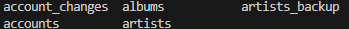
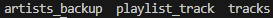
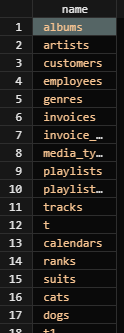

# SQLite SHOW TABLES #########################

[Файл с запросами][querys]   
[Оригинальная статья][origin]

[querys]: ./querys.sql
[origin]: https://www.sqlitetutorial.net/sqlite-show-tables/

## Обзор ##############################

В этом руководстве вы узнаете несколько путей увидеть таблицы в базе SQLite путем использования командной строки или выбора данных их таблиц `sqlite_master`.

## Вывод таблиц используя командную строку SQLite

Для вывода таблиц БД используя командную строку SQLite, следуйте слудующим шагам:

1. Откройте базу, в которой вы хотите увидеть таблицы:

~~~ SQL ~~~~~~~~~~~~~~~~~~~~~~~~~~~~~~~
sqlite c:\sqlite\db\chinook.db
~~~~~~~~~~~~~~~~~~~~~~~~~~~~~~~~~~~~~~~

В выражении выше открывается БД под названием `chinool.db`, которая расположена в директории `c:\slite\db`.

2. Введите команду `.tables`:

~~~ SQL ~~~~~~~~~~~~~~~~~~~~~~~~~~~~~~~
.tables
~~~~~~~~~~~~~~~~~~~~~~~~~~~~~~~~~~~~~~~

Команда `.tables` выведет список всех таблиц базы `chinook`

![tables]

> Обратите внимание, что обе команды `.tables` и `.talbe` имеют один и тот же эффект, также есть сокращенная команда `.ta`.

Команда `.tables` также может использоваться для вывода временных таблиц. Посмотрите следующий пример:

1. Создадим новую временную таблицу `temp_table1`:

~~~ SQL ~~~~~~~~~~~~~~~~~~~~~~~~~~~~~~~
CREATE TEMPORARY TABLE temp_table1 ( name TEXT );
~~~~~~~~~~~~~~~~~~~~~~~~~~~~~~~~~~~~~~~

2. Выведем все таблицы базы:

~~~ SQL ~~~~~~~~~~~~~~~~~~~~~~~~~~~~~~~
.tables
~~~~~~~~~~~~~~~~~~~~~~~~~~~~~~~~~~~~~~~

Ниже показан вывод команды:

![temp_tables]

Поскольку схема для временных таблиц `temp`, команда показывает название схемы и название временной таблицы как `temp.temp_table1`.

Если вы хотите вывести таблицы с указанным именем, вы можете добавить шаблон поиска:

~~~ SQL ~~~~~~~~~~~~~~~~~~~~~~~~~~~~~~~
.tables pattern
~~~~~~~~~~~~~~~~~~~~~~~~~~~~~~~~~~~~~~~

Эта команда работает так же как и оператор `LIKE`. Шаблон должен быть окружен одинарными ковычками (`'`).

Для примера, найдем таблицы, чти имена начинаются на букву `a`. Используем следующее выражение:

~~~ SQL ~~~~~~~~~~~~~~~~~~~~~~~~~~~~~~~
.table 'a%'
~~~~~~~~~~~~~~~~~~~~~~~~~~~~~~~~~~~~~~~

Для вывода таблиц, чьи имена содержат `ck`, используем шаблон `%ck%` как показано ниже:

~~~ SQL ~~~~~~~~~~~~~~~~~~~~~~~~~~~~~~~
.tables '%ck%'
~~~~~~~~~~~~~~~~~~~~~~~~~~~~~~~~~~~~~~~

## Вывод таблиц используя выражение SQLite

Другой способ вывести список таблиц БД, это запросить данные из таблицы `sqlite_schema`.

~~~ SQL ~~~~~~~~~~~~~~~~~~~~~~~~~~~~~~~
SELECT
  name
FROM
  sqlite_schema
WHERE
  type = 'table' AND
  name NOT LIKE 'sqlite_%';
~~~~~~~~~~~~~~~~~~~~~~~~~~~~~~~~~~~~~~~

В запросе мы отфильтровываем таблицы, чьи имена начинаются с `sqlite_`, такие как `sqlite_stat1` и `sqlite_sequence`. Эти таблицы являются системными и используются SQLite.

> Обратите внимание, что SQLite изменила название таблицы `sqlite_master` на `sqlite_schema`.

---------------------------------------

Предидущее руководство < [SQLite VACUUM][prev]  
Следующее руководство > [SQLite DESCRIBE TABLE][next]

[prev]: ../45_Vacuum/translate.md
[next]: ../47_DescribeTable/translate.md

[tables]: ./tables.png
[temp_tables]: ./temp_table.png