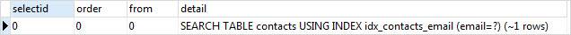
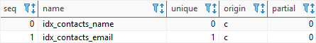
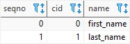

# SQLite INDEX #########################

[Файл с запросами][querys]   
[Оригинальная статья][origin]

[querys]: ./querys.sql
[origin]: https://www.sqlitetutorial.net/sqlite-index/

## Обзор ##############################

В этом руководстве вы узнаете, как использовать SQLite индексы для ускорения запросов, ускорения сортировки и применять уникальные ограничения.

## Что такое Индекс?

В реляционных базах данных, таблицы это набор строк. В то же время, каждая строка имеет структуру столбцов, которые образуют ячейки. Каждая строка также имеет последовательный rowid, который используется для идентификации строк. Таким образом, вы можете представить таблицу как список пар ключ-значение: (rowid, строка).

В отличии от таблицы, индекс имеет противоположное отношение: (строка, rowid). Индекс это дополнительная структура, которая помогает повысить производительность запроса.

![index]

SQLite использует Б-дерево для организации индекса. 

> Обратите внимание, что **Б** это не бинарное, а сбалансированое дерево.

В Б-дереве, все данные расположены по обе стороны дерева (сбалансированы), таким образом, чтобы количество уровней дерева, всегда было примерно одинаковым числом. В дополнение, запросы использующие равенстао (=) и диапазоны (<,>=,<,<=) очень эффуктивны.

## Как работает индекс

Каждый индекс должен быть отнесен к определенной таблице. Индекс может быть составлен из одного или нескольких столбцов, но все столбцы должны быть из одной и тойже таблицы. Таблица может иметь несколько индексов.

Какждый раз, когда вы создаете индекс, SQLite создает Б-дерево для хранения данных индекса.

Индекс содержит данные из столбца, который вы указали при в индексе, и соответствующий `rowid`. Это помогает SQLite быстро находить строку, основываясь на значении индексированного столбца.

Думайте о индексе в БД как об индексе в книге или запискной книжке. Использую индекс вы можете быстро искать страницу кники основываясь на ключевом слове.

## Выражение SQLite `CREATE INDEX`

Для создания индекса используется выражение `CREATE INDEX` со следующим синтаксисом:

``````````````````````````````````` SQL
CREATE [UNIQUE] INDEX index_name
ON table_name(column_list);
```````````````````````````````````````

Для создания индекса укажите следующую информацию:

- Название индекса после ключевого слова `CREATE INDEX`

- Название таблицы, которой принадлежит индекс

- Список столбцов индекса

В случае, если вы хотите убедится в том, что один или несколько столбцов являются уникальными, такие как телефон или e-mail, используйте опцию `UNIQUE` в выражении. `CREATE UNIQUE INDEX` создаст новый уникальный индекс.

## Пример SQLite `UNIQUE`

Давайте создадим новую таблицу `contacts` для демонстрации:

``````````````````````````````````` SQL
CREATE TABLE contacts (
  firstName TEXT NOT NULL,
  lastName TEXT NOT NULL,
  email TEXT NOT NULL
);
```````````````````````````````````````

Предположим, вы хотите указать, что почта должна быть уникальной, для этого вы должны создать уникальный индекс, как показано ниже:

~~~ SQL ~~~~~~~~~~~~~~~~~~~~~~~~~~~~~~~
CREATE UNIQUE INDEX idx_contacts_email
ON contacts (email);
~~~~~~~~~~~~~~~~~~~~~~~~~~~~~~~~~~~~~~~

Для того, чтобы протестировать это, выполним следующие шаги:

1. Вставим строку в таблицу:

~~~ SQL ~~~~~~~~~~~~~~~~~~~~~~~~~~~~~~~
INSERT INTO contacts (firstName, lastName, email)
VALUES('John','Doe','john.doe@sqlitetutorial.net');
~~~~~~~~~~~~~~~~~~~~~~~~~~~~~~~~~~~~~~~

2. Вставим другую строку с дубликатом `email`:

~~~ SQL ~~~~~~~~~~~~~~~~~~~~~~~~~~~~~~~
INSERT INTO contacts (firstName, lastName, email)
VALUES('Johny','Doe','john.doe@sqlitetutorial.net');
~~~~~~~~~~~~~~~~~~~~~~~~~~~~~~~~~~~~~~~

SQLite выдаст ошибку, в которой говорится о том, что уникальный индекс был нарушен. Из-за того, что вы хотите вставить строку с повторной почтой, SQLite проверяет строку на уникальность по всей таблице.

Давайте вставим еще несколько строк в таблицу:

~~~ SQL ~~~~~~~~~~~~~~~~~~~~~~~~~~~~~~~
INSERT INTO contacts (firstName, lastName, email)
VALUES('David','Brown','david.brown@sqlitetutorial.net'),
      ('Lisa','Smith','lisa.smith@sqlitetutorial.net');
~~~~~~~~~~~~~~~~~~~~~~~~~~~~~~~~~~~~~~~

Если выбрать данные из таблицы `contacts`, основываясь на определенном email, SQLite использует индекс для поиска информации. Посмотрите выражение ниже:

~~~ SQL ~~~~~~~~~~~~~~~~~~~~~~~~~~~~~~~
SELECT
  firstName,
  lastName,
  email
FROM
  contacts
WHERE
  email = 'lisa.smith@sqlitetutorial.net';
~~~~~~~~~~~~~~~~~~~~~~~~~~~~~~~~~~~~~~~

Для того, чтобы проверить, использует ли SQLite индекс, или нет, используется выражение `EXPLAIN QUERY PLAN` как показано ниже:

~~~ SQL ~~~~~~~~~~~~~~~~~~~~~~~~~~~~~~~
EXPLAIN QUERY PLAN
SELECT
  firstName,
  lastName,
  email
FROM
  contacts
WHERE
  email = 'lisa.smith@sqlitetutorial.net';
~~~~~~~~~~~~~~~~~~~~~~~~~~~~~~~~~~~~~~~



## Пример индекса с несколькими колонками индекса SQLite

Если вы создаете индекс, содержащий один столбец, SQLite использует этот столбец в качестве ключа сортировки. В случае если созданный индекс имеет несколько столбцов, SQLite использует дополнительные колонки как вторичный, третичный и т.д. ключи сортировки.

SQLite сортироует данные по индексу первого столбца, указанного в выражении `CREATE INDEX`. Затем, он сортирует повторяющиеся значения по второму столбцу и т.д.

Следовательно, порядок столбцов в индексе имеет очень большое значение.

Для использования многоколоночного индекса, запрос должен содержать условие, которое имеет тотже порядок столбцов, который объявлен в индексе.

Следующее выражение создает многоколоночный индекс по столбцам `firstName` и `lastName`:

~~~ SQL ~~~~~~~~~~~~~~~~~~~~~~~~~~~~~~~
CREATE INDEX idx_contacts_name
ON contacts ( firstName, lastName );
~~~~~~~~~~~~~~~~~~~~~~~~~~~~~~~~~~~~~~~

Если вы выберете данные из таблицы `contacts` с одним из следующих условий, SQLite применит индекс:

1. Фильтрация данных по колонке `firstName`:

~~~ SQL ~~~~~~~~~~~~~~~~~~~~~~~~~~~~~~~
WHERE
  firstName = 'John';
~~~~~~~~~~~~~~~~~~~~~~~~~~~~~~~~~~~~~~~

2. Фильтрация данных по обоим колонкам:

~~~ SQL ~~~~~~~~~~~~~~~~~~~~~~~~~~~~~~~
WHERE
  firstName = 'John' AND lastName = 'Doe';
~~~~~~~~~~~~~~~~~~~~~~~~~~~~~~~~~~~~~~~

Однако, SQLite не применит индекс, если вы используете одно из следующих условий:

1. Фильтрация по колонке `lastName`: 

~~~ SQL ~~~~~~~~~~~~~~~~~~~~~~~~~~~~~~~
WHERE
  lastName = 'Doe';
~~~~~~~~~~~~~~~~~~~~~~~~~~~~~~~~~~~~~~~

2. Фильтрация по обоим колонкам в неправильном порядке:

~~~ SQL ~~~~~~~~~~~~~~~~~~~~~~~~~~~~~~~
lastName = 'Doe' OR 'firstName' = 'John';
~~~~~~~~~~~~~~~~~~~~~~~~~~~~~~~~~~~~~~~

## Вывод индексов SQLite

Для того, чтобы найти индексы, связанные с таблицей, используется следующая команда:

~~~ SQL ~~~~~~~~~~~~~~~~~~~~~~~~~~~~~~~
PRAGMA index_list('table_name');
~~~~~~~~~~~~~~~~~~~~~~~~~~~~~~~~~~~~~~~

Например, следующее выражение показывает все индексы таблицы `contacts`:

~~~ SQL ~~~~~~~~~~~~~~~~~~~~~~~~~~~~~~~
PRAGMA index_list('contacts');
~~~~~~~~~~~~~~~~~~~~~~~~~~~~~~~~~~~~~~~



Для получения информации о столбцах индекса используется следующее выражение:

~~~ SQL ~~~~~~~~~~~~~~~~~~~~~~~~~~~~~~~
PRAGMA index_info('idx_contacts_name');
~~~~~~~~~~~~~~~~~~~~~~~~~~~~~~~~~~~~~~~

Пример вернет список колонок:



Другой путь для получения всех индексов в БД это запрос из таблицы `sqlite_master`:

~~~ SQL ~~~~~~~~~~~~~~~~~~~~~~~~~~~~~~~
SELECT
  type,
  name,
  tbl_name,
  sql
FROM
  sqlite_master
WHERE
  type = 'index';
~~~~~~~~~~~~~~~~~~~~~~~~~~~~~~~~~~~~~~~

## Выражение `DROP INDEX`

Для удаления индекса из таблицы используется выражение `DROP INDEX`:

~~~ SQL ~~~~~~~~~~~~~~~~~~~~~~~~~~~~~~~
DROP INDEX [IF EXISTS] index_name;
~~~~~~~~~~~~~~~~~~~~~~~~~~~~~~~~~~~~~~~

Сдесь вы указываете название индекса который хотите удалить после ключегоко слова `DROP INDEX`. Укажите `IF EXISTS` если вы хотите удалить индекс, только если он существует:

Например, вот выражение для удаления индекса `idx_contacts_name`:

~~~ SQL ~~~~~~~~~~~~~~~~~~~~~~~~~~~~~~~
DROP INDEX idx_contacts_name;
~~~~~~~~~~~~~~~~~~~~~~~~~~~~~~~~~~~~~~~

---------------------------------------

Предидущее руководство < [SQLite DROP VIEW][prev]  
Следующее руководство > [SQLite INDEX FOR EXPRESSIONS][next]

[prev]: ../52_DropView/translate.md
[next]: ../54_IndexForExpressions/translate.md

[index]: SQLite-Index.png