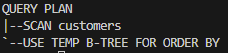
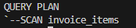

# SQLite INDEX FOR EXPRESSION #########################

[Файл с запросами][querys]   
[Оригинальная статья][origin]

[querys]: ./querys.sql
[origin]: https://www.sqlitetutorial.net/sqlite-index-expression/

## Обзор ##############################

В это руководстве вы узнаете, как использовать индексы, основанные на выражениях для увеличения производительности запросов, особенно тех, которые используют выражения или функции.

## Введение в индексы-выражения

Когда вы создаете индекс, обычно вы используете один или несколько столбцов. В дополнение к обычным индексам, SQLite позволяет вам создавать индексы основанные на выражениях используемых столбцы таблицы. Этот вид индексов называется индексы, основанные на выражениях.

Следующее выражение выбирает клиентов, чья длинна названия компании больше чем 10 символов.

~~~ SQL ~~~~~~~~~~~~~~~~~~~~~~~~~~~~~~~
SELECT 
  customerId,
  company
FROM
  customers
WHERE
  length(company) > 10
ORDER BY length(company) DESC;
~~~~~~~~~~~~~~~~~~~~~~~~~~~~~~~~~~~~~~~

Если вы примените выражение `EXPLAIN QUERY PLAN`, то увидите, что планировщик запросов SQLite сканрует всю таблицу `customers` чтобы вернуть результирующий набор.

~~~ SQL ~~~~~~~~~~~~~~~~~~~~~~~~~~~~~~~
EXPLAIN QUERY PLAN
SELECT 
  customerId,
  company
FROM
  customers
WHERE length(company) > 10
ORDER BY length(company) DESC;
~~~~~~~~~~~~~~~~~~~~~~~~~~~~~~~~~~~~~~~

> Планировщик запросов SQLite, это компонень, который определяет лучший       алгоритм или план запроса для выполнения выражения. В версии 3.8.0 планировщик запросов был переписан для более быстрой генерации лучших планов выполнения. Переписаных планировщик называется планировщиком запросов нового поколния или NGQP (`N`ext `G`eneration `Q`uery `P`lanner)

> Для создания индекса, основанного на выражении `LENGTH(company)` используйте следующее выражения.

~~~ SQL ~~~~~~~~~~~~~~~~~~~~~~~~~~~~~~~
CREATE INDEX customers_length_company
ON customers( LENGTH(company) );
~~~~~~~~~~~~~~~~~~~~~~~~~~~~~~~~~~~~~~~

Теперь, если вы снова выполните план выполения, SQLite будет использовать созданный индекс для поиска выбранных данных, что быстрее.

## Как работает индекс выражения

Планировщик запросов SQLite использует индекс выражения только в том случае, если вы указали в выражении `CREATE INDEX` точно такое-же условия, что и в предложении `WHERE` или `ORDER BY`.

Например, в тестовой базе данных мы имеем таблицу `invoice_items`.

Следующее выражение создает индекс, использующий цену и количество товара.

~~~ SQL ~~~~~~~~~~~~~~~~~~~~~~~~~~~~~~~
CREATE INDEX invoice_line_amount
ON invoice_items( unitPrice * quantity );
~~~~~~~~~~~~~~~~~~~~~~~~~~~~~~~~~~~~~~~

Однако, если вы запустите запрос:

~~~ SQL ~~~~~~~~~~~~~~~~~~~~~~~~~~~~~~~
EXPLAIN QUERY PLAN
SELECT
  invoicelineid,
  invoiceid, 
  unitprice*quantity
FROM invoice_items
WHERE quantity*unitprice > 10;
~~~~~~~~~~~~~~~~~~~~~~~~~~~~~~~~~~~~~~~

Планировщик запросов не использует индекс, так как условие `CREATE INDEX (unitPrice * quantity)` не такоеже, как в условии `WHERE`.

## Ограничения индекса выражений

Ниже представлен список ограничений на использование индекса выражений:

1. Выражение должно ссылатся на столбцы, которые есть в индексируемой таблице. Условие не может ссылатся на столбцы из других таблиц.

2. Выражение может использовать только детерминированные функции.

3. Выражение не может содержать подзапрос.

---------------------------------------

Предидущее руководство < [SQLite INDEX][prev]  
Следующее руководство > [SQLite TRIGGER][next]

[prev]: ../53_Index/translate.md
[next]: ../55_Trigger/translate.md