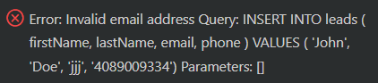
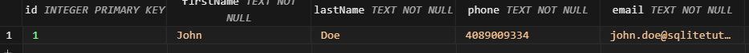
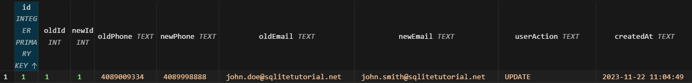

# SQLite TRIGGER #########################

[Файл с запросами][querys]   
[Оригинальная статья][origin]

[querys]: ./querys.sql
[origin]: https://www.sqlitetutorial.net/sqlite-trigger/

## Обзор ##############################

В этом руководстве мы поговорим о триггерах SQLite, которые являются объектами БД и срабатывают автоматически, когда данные в таблице меняются.

## Что такое триггер SQLite

Триггер SQLite это именованный объект БД, который выполняется автоматически, когда в таблице исполняются выражения `INSERT`, `UPDATE` или `DELETE`.

## Когда нам нужны триггеры SQLite

Чаще всего триггеры используются для сложного аудита. К примеру, вы хотите логировать изменения чувствительных данных, таких как зарплаты и адреса, когда они меняются.

Дополнительно, триггеры используются, когда вам нужно реализовать сложную бизнес логику централизованно, на уровне БД и предотвратить недействительные транзакции.

## Выражение `CREATE TRIGGER` SQLite

Для создания нового триггера в SQLite, используется выражение `CREATE TRIGGER` как показано ниже:

~~~ SQL ~~~~~~~~~~~~~~~~~~~~~~~~~~~~~~~
CREATE TRIGGER [IF NOT EXISTS] trigger_name
  [BEFORE|AFTER|INSTEAD OF] [INSERT|UPDATE|DELETE]
  ON table_name
  [WHEN condition]
BEGIN
  statements;
END;
~~~~~~~~~~~~~~~~~~~~~~~~~~~~~~~~~~~~~~~

В этом выражении:

1. Укажите название триггера после ключевых слов `CREATE TRIGGER`.

2. Определите, когда триггер должен сработать: `BEFORE`, `AFTER` или `INSTEAD OF`. Вы можете создать триггеры `BEFORE` и `AFTER` на таблице. Однако, триггер `INSTEAD OF` вы можете создать только на представлении.

3. Укажите эвент, при котором триггер будет срабатывать: `INSERT`, `UPDATE` или `DELETE`.

4. После этого, укажите таблицу, к которой принадлежит триггер.

5. Наконец, поместите логику триггера в блок `BEGIN END`, который должен быть валидным SQL выражением.

Если вы скомбинируете время выполнения триггера и события, по которому он вызывается, то у вас получится 9 возможных вариантов:

- `BEFORE INSERT`
- `AFTER INSERT`
- `BEFORE UPDATE`
- `AFTER UPDATE`
- `BEFORE DELETE`
- `AFTER DELETE`
- `INSTEAD OF INSERT`
- `INSTEAD OF DELETE`
- `INSTEAD OF UPDATE`

Предположим, вы хотите использовать выражение `UPDATE`, для обновления 10и строк в таблице, триггер будет вызван 10 раз. Этот триггер называется `FOR EACH ROW`. Если триггер вызывается один раз, мы называем его `FOR EACH STATEMENT`.

Начиная с версии 3.9.2 поддерживается только `FOR EACH ROW` триггеры. `FOR EACH STATEMENT` триггеры больше не поддерживаются.

Если вы используете выраежение `WHEN`, триггер будет вызван только тогда, когда оно бедет `TRUE`. В случае если вы пропустили выражение `WHEN`, триггер будет вызван для всех строк.

> Обратите внимание, что если вы удаляете таблицу, то все связанные с ней триггеры, также будут удалены. Однако, если триггер ссылается на другие таблицы, и если они будут удалены или изменены, то такой триггер останется без изменений.

К примеру, если триггер ссылается на таблицу `people`, вы удаляете таблицу, или переименовываете её, то вы должны вручную изменить объявления триггера.

Вы можете получить доступ к стоке, которая была вставлена, удалена или обновлена, используя ссылки `OLD` и `NEW`: `OLD.column_name` или `NEW.column_name`.

Ссылки `OLD` и `NEW` доступны в зависимости от события:

| Action    | Reference                           |
|-----------|-------------------------------------|
| INSERT    | `NEW` доступно                      |
| UPDATE    | Обе ссылки `NEW` и `OLD` доступны   |
| DELETE    | `OLD` доступно                      |

## Примеры триггеров SQLite

Давайте создадим таблицу `leads`, которая будет хранить информацию по руководителям компании.

~~~ SQL ~~~~~~~~~~~~~~~~~~~~~~~~~~~~~~~
CREATE TABLE leads (
  id INTEGER PRIMARY KEY,
  firstName TEXT NOT NULL,
  lastName TEXT NOT NULL,
  phone TEXT NOT NULL,
  email TEXT NOT NULL,
  source TEXT NOT NULL
);
~~~~~~~~~~~~~~~~~~~~~~~~~~~~~~~~~~~~~~~

### 1. Пример триггера `BEFORE INSERT`

Предположим, вы хотите валидировать электронную почту перед тем, как вставить новую строку в таблицу `leads`. В этом случае вы можете использовать триггер `BEFORE INSERT`.

1. Создайте триггер как показано ниже:

~~~ SQL ~~~~~~~~~~~~~~~~~~~~~~~~~~~~~~~
CREATE TRIGGER validate_email_before_insert_leads
  BEFORE INSERT ON leads
BEGIN
  SELECT
    CASE
      WHEN NEW.email NOT LIKE '%_@__%.__%' THEN
        RAISE ( ABORT, 'Invalid email address' )
      END;
END;
~~~~~~~~~~~~~~~~~~~~~~~~~~~~~~~~~~~~~~~

Мы использовали ссылку `NEW` для доступа к столбцу `email` строки, которую мы пытаемся вставить.

Для валидации почты, мы испльзуем оператор `LIKE` для определения, удовлетворяет ли почта заданному шаблону. Если почта не валидна, функция `RAISE` прекращает вставку и выбрасывает сообщение об ошибке.

2. Вставим строку с невалидной почтой в таблицу `leads`:

~~~ SQL ~~~~~~~~~~~~~~~~~~~~~~~~~~~~~~~
INSERT INTO leads ( firstName, lastName, email, phone )
VALUES ('John', 'Doe', 'jjj', '4089009334');
~~~~~~~~~~~~~~~~~~~~~~~~~~~~~~~~~~~~~~~

SQLite выдаст ошибку: "Invalid email address" и прекратит выполнение вставки.

3. Вставим строку с валидной почтой:

~~~ SQL ~~~~~~~~~~~~~~~~~~~~~~~~~~~~~~~
INSERT INTO leads ( firstName, lastName, email, phone, source )
VALUES ('John', 'Doe', 'john.doe@sqlitetutorial.net', '4089009334', 'insert')
~~~~~~~~~~~~~~~~~~~~~~~~~~~~~~~~~~~~~~~

Поскольку почта валидна, вставка выполнелась успешно.

### 2. Пример триггера `AFTER UPDATE`

Телефоны и почты руководителей являются очень важной информацией, которую вы не можете позволить себе потерять. К примеру, кто-нибудь случайно изменил данные на неправильные, или вовсе удалил.

Для защиты этой важной информации вы можете использовать триггер для логирования изменений, которые происходят с телефонами и почтой.

1. Создадим таблицу `leads_logs` для хранения испорической информации.

~~~ SQL ~~~~~~~~~~~~~~~~~~~~~~~~~~~~~~~
CREATE TABLE leads_logs (
  id INTEGER PRIMARY KEY,
  oldId INT,
  newId INT,
  oldPhone TEXT,
  newPhone TEXT,
  oldEmail TEXT,
  newEmail TEXT,
  userAction TEXT,
  createdAt TEXT
);
~~~~~~~~~~~~~~~~~~~~~~~~~~~~~~~~~~~~~~~

2. Создадим триггер `AFTER UPDATE` для логирования в таблицу `leads_logs`, когда проимходит обновление полей телефона и почты:

~~~ SQL ~~~~~~~~~~~~~~~~~~~~~~~~~~~~~~~
CREATE TRIGGER log_contact_after_update
  AFTER UPDATE ON leads
  WHEN OLD.phone <> NEW.phone
    OR OLD.email <> NEW.email
BEGIN
  INSERT INTO leads_logs (
    oldId,
    newId,
    oldPhone,
    newPhone,
    oldEmail,
    newEmail,
    userAction,
    createdAt
  )
  VALUES (
    OLD.id,
    NEW.id,
    OLD.phone,
    NEW.phone,
    OLD.email,
    NEW.email,
    'UPDATE',
    DATETIME('NOW')
  );
END;
~~~~~~~~~~~~~~~~~~~~~~~~~~~~~~~~~~~~~~~

> Обратите внимание на условие `WHEN`, которое указывает на то, что триггер должен срабатывать только при условии обновления полей телефона и почты.

3. Обновим фамилию `John` и `Doe` на `Smith`

~~~ SQL ~~~~~~~~~~~~~~~~~~~~~~~~~~~~~~~
UPDATE leads
SET
  lastName = 'Smith'
WHERE
  id = 1;
~~~~~~~~~~~~~~~~~~~~~~~~~~~~~~~~~~~~~~~

Триггер не будет вызван, так как не изменился телефон или почта.

4. Обновим телефон и почту у `John`

~~~ SQL ~~~~~~~~~~~~~~~~~~~~~~~~~~~~~~~
UPDATE leads
SET
  phone = '4089998888',
  email = 'john.smith@sqlitetutorial.net'
WHERE
  id = 1;
~~~~~~~~~~~~~~~~~~~~~~~~~~~~~~~~~~~~~~~

Если проверить таблицу `leads_logs`, то там появилась запись с изменениями

Можете разработать триггеры `AFTER INSERT` и `AFTER DELETE` для логирования данных в таблицу `leads_logs` в качестве упражнения.

## Выражение `DRPO TRIGGER`

Для удаления существующего триггера используется выражение `DROP TRIGGER`:

~~~ SQL ~~~~~~~~~~~~~~~~~~~~~~~~~~~~~~~
DROP TRIGGER [IF EXISTS] trigger_name;
~~~~~~~~~~~~~~~~~~~~~~~~~~~~~~~~~~~~~~~

В этом выражении:

1. Укажите название триггера, который вы хотите удалить после ключегоко слова `DROP TRIGGER`

2. Используйте опцию `IF EXISTS` если вы хотите удалить триггер только если он существует.

> Обратите внимание, что если вы удалите таблицу, то SQLite автоматически удалит все триггеры, которые навешаны на данную таблицу.

Для примера, удалим триггер `validate_email_before_insert_leads`, как показано ниже:

~~~ SQL ~~~~~~~~~~~~~~~~~~~~~~~~~~~~~~~
DROP TRIGGER validate_email_before_insert_leads;
~~~~~~~~~~~~~~~~~~~~~~~~~~~~~~~~~~~~~~~

---------------------------------------

Предидущее руководство < [SQLite INDEX FOR EXPRESSIONS][prev]  
Следующее руководство > [SQLite INSTEAD OF TRIGGER][next]

[prev]: ../54_IndexForExpressions/translate.md
[next]: ../56_InsteadOfTrigger/translate.md