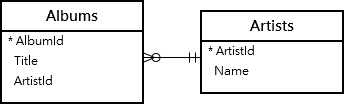
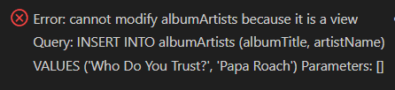
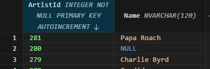
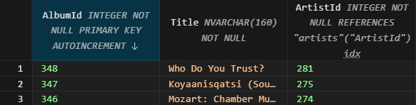

# SQLite INSTEAD OF TRIGGERS #########################

[Файл с запросами][querys]   
[Оригинальная статья][origin]

[querys]: ./querys.sql
[origin]: https://www.sqlitetutorial.net/sqlite-instead-of-triggers/

## Обзор ##############################

В этом руководстве вы узнаете о триггерах SQLite `INSTEAD OF` и как создовать из для вставки данных в таблицы через представление.

## Что такое триггер `INSTEAD OF`

В SQLite триггеры `INSTEAD OF` могут быть созданны только на представлении, а не на таблице.

Представления являются только для чтения в SQLite. И если вы выполните DML выражения, такие как `INSERT`, `UPDATE`, или `DELETE` на представлении, вы получите ошибку.

Когда на представлении есть триггер `INSTEAD OF`, он будет вызван когда вы выполните соответствующее DML выражение. Это позволяет вам внедрить свою собственную логику в этот процесс.

Например, если в представлении есть триггер `INSTEAD OF INSERT`, то, когда вы выполните выражение `INSERT`, триггер будет вызван автоматически. Внутри триггера вы можете делать инсёрты, апдейты или делиты в базовых табилцах представления.

Другими словами, `INSTEAD OF` посзоляет вашим представлениям быть изменяемыми.

Ниже показан синтаксис создания триггера `INSTEAD OF`:

~~~ SQL ~~~~~~~~~~~~~~~~~~~~~~~~~~~~~~~
CREATE TRIGGER [IF NOT EXISTS] schema_name.trigger_name
  INSTEAD OF [DELETE | INSERT | UPDATE OF column_name]
  ON table_name
BEGIN
  -- insert code here
END;
~~~~~~~~~~~~~~~~~~~~~~~~~~~~~~~~~~~~~~~

Это означает:

1. Укажите название триггера после ключевого слова `CREATE TRIGGER`. Испльзуйте `IF NOT EXISTS` если вы хотите создать триггер только если он не существует.

2. Используйте ключевое слово `INSTEAD OF` вместе с событием `INSERT`, `UPDATE`, `DELETE`

3. Укажите название представления к которому будет принадлежать этот триггер

4. Укажите код, который быдет выполнять вашу логику

## Примеры триггера `INSTEAD OF`

Для демонстации мы будем использовать таблицы `artists` и `albums` из тестовой БД

1. Создадим представление `albumArtists` которое будет основано на таблицах `artists` и `albums`:

~~~ SQL ~~~~~~~~~~~~~~~~~~~~~~~~~~~~~~~
CREATE VIEW albumArtists (
  albumTitle,
  artistName
) AS 
SELECT
  title,
  name
FROM
  albums
INNER JOIN artists USING (artistId);
~~~~~~~~~~~~~~~~~~~~~~~~~~~~~~~~~~~~~~~

2. Используйте запрос, чтобы проверить результат: 

~~~ SQL ~~~~~~~~~~~~~~~~~~~~~~~~~~~~~~~
SELECT * FROM albumArtists;
~~~~~~~~~~~~~~~~~~~~~~~~~~~~~~~~~~~~~~~

3. Вставьте новую строку в представление `albumArtists`

~~~ SQL ~~~~~~~~~~~~~~~~~~~~~~~~~~~~~~~
INSERT INTO albumArtists (albumTitle, artistName)
VALUES ('Who Do You Trust?', 'Papa Roach');
~~~~~~~~~~~~~~~~~~~~~~~~~~~~~~~~~~~~~~~

SQLite выдаст следующую ошибку:

4. Создайте триггер `INSTEAD OF`, который будет вызываться во время инсерта в представление `albumArtists`:

~~~ SQL ~~~~~~~~~~~~~~~~~~~~~~~~~~~~~~~
CREATE TRIGGER insert_artist_album_trg
  INSTEAD OF INSERT ON albumArtists
BEGIN
  INSERT INTO artists(name)
  VALUES (NEW.artistName);

  INSERT INTO albums (title, artistId)
  VALUES (NEW.albumTitle, last_insert_rowid());
END;
~~~~~~~~~~~~~~~~~~~~~~~~~~~~~~~~~~~~~~~

1. Вставка строки в табилицу `artists`. SQLite автоматически сгенерирует номер для столбца `artistId`.

2. Используйте `last_insert_rowid()` для генерации значения из столбца `artistId` и вставит строку в таблицу `albums`.

Наконец, проверьте вставку в таблицы:

Как вы можете видеть, новая строка была вставлена в таблицы `artists` и `albums`

---------------------------------------

Предидущее руководство < [SQLite TRIGGER][prev]  
Следующее руководство > [SQLite FUNCTIONS][next]

[prev]: ../55_Trigger/translate.md
[next]: ../57_Functions/translate.md