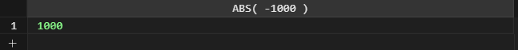
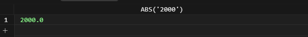
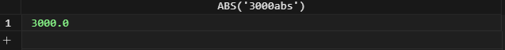
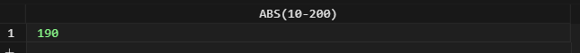
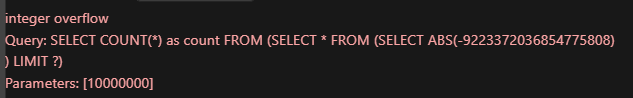

# SQLite ABS #########################

[Файл с запросами][querys]   
[Оригинальная статья][origin]

[querys]: ./querys.sql
[origin]: https://www.sqlitetutorial.net/sqlite-functions/sqlite-abs/

## Обзор ##############################

Функция SQLite ABS возвращает абсолютное значение аргумента.

Если аргумент равен `NULL` функция вернет `NULL`.

Если вы передадите в качестве аргумента BLOB или строку, функция `ABS` попробует сконвертировать ее в число. Если конвертация не удалась, функция вернет `0`.

Если аргумент будет чилсом `-9223372036854775808`, то функция выдаст ошибку переполнения, потому что не может принять отрицательное число `64-bit` в качестве аргумента.

## Синтаксис

~~~ SQL ~~~~~~~~~~~~~~~~~~~~~~~~~~~~~~~
ABD(N)
~~~~~~~~~~~~~~~~~~~~~~~~~~~~~~~~~~~~~~~

## Аргументы

`N` - это число или выражение, которое может быть сконвертировано в число.

## Тип возвращаемого значения

Функция `ABS` возвращает тип данных аргумента.

## Примеры

Следующее выражение использует функцию `ABS` для вычисления абсолютного значения числа `-1000`:

~~~ SQL ~~~~~~~~~~~~~~~~~~~~~~~~~~~~~~~
SELECT ABS( -1000 );
~~~~~~~~~~~~~~~~~~~~~~~~~~~~~~~~~~~~~~~

Следующий пример показывает, как вычисляется значение строки, которая может быть преобразована в число:

~~~ SQL ~~~~~~~~~~~~~~~~~~~~~~~~~~~~~~~
SELECT ABS('2000');
~~~~~~~~~~~~~~~~~~~~~~~~~~~~~~~~~~~~~~~

Еще один пример:

~~~ SQL ~~~~~~~~~~~~~~~~~~~~~~~~~~~~~~~
SELECT ABS('3000abs');
~~~~~~~~~~~~~~~~~~~~~~~~~~~~~~~~~~~~~~~

Однаео следующее выражение вернет `0`, поскольку SQLite не может преобразовать тип:

~~~ SQL ~~~~~~~~~~~~~~~~~~~~~~~~~~~~~~~
SELECT ABS('sqlite4000');
~~~~~~~~~~~~~~~~~~~~~~~~~~~~~~~~~~~~~~~

Следующее выражение показывает, как сипользовать функцию `ABS` с выражением:

~~~ SQL ~~~~~~~~~~~~~~~~~~~~~~~~~~~~~~~
SELECT ABS(10-200);
~~~~~~~~~~~~~~~~~~~~~~~~~~~~~~~~~~~~~~~

Если вы запустите следующее выражение, то получите ошибку:

~~~ SQL ~~~~~~~~~~~~~~~~~~~~~~~~~~~~~~~
SELECT ABS(-9223372036854775808);
~~~~~~~~~~~~~~~~~~~~~~~~~~~~~~~~~~~~~~~

---------------------------------------

Предидущее руководство < [SQLite FUNCTIONS][prev]  
Следующее руководство > [SQLite RANDOM][next]

[prev]: ../57_Functions/translate.md
[next]: ../59_Random/translate.md