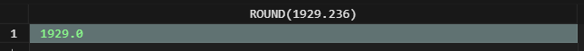

# SQLite ROUND #########################

[Файл с запросами][querys]   
[Оригинальная статья][origin]

[querys]: ./querys.sql
[origin]: https://www.sqlitetutorial.net/sqlite-functions/sqlite-round/

## Обзор ##############################

Функция SQLite `ROUND()` возвращает число с прлавающей точкой, которое представляет округлунное значение с заданной точностью.

## Синтаксис

~~~ SQL ~~~~~~~~~~~~~~~~~~~~~~~~~~~~~~~
ROUND(value, precision)
~~~~~~~~~~~~~~~~~~~~~~~~~~~~~~~~~~~~~~~

## Аргументы

Функция `ROUND()` принимает два аргумента.

### value

Число с плавающей точкой или выражение, которое вычисляется как число с плавающей точкой.

### precision

`precision` - позитивное целочисленное число. Число округляется до ближайшего предстваления, а не до нуля.

Если значение или точность равны `NULL`, функция `ROUND()` вернёт `NULL`. Если вы пропустите аргумент `precision`, он будут считаться нулём. Результатом будет целое число, хотя оно будет вчитаться число с плавающей точкой.

## Тип возвращаемого значения

~~~ SQL ~~~~~~~~~~~~~~~~~~~~~~~~~~~~~~~
Real
~~~~~~~~~~~~~~~~~~~~~~~~~~~~~~~~~~~~~~~

## Примеры

Следующее выражение использует функцию `ROUND()` для округления до сотых:

~~~ SQL ~~~~~~~~~~~~~~~~~~~~~~~~~~~~~~~
SELECT ROUND(1929.236, 2);
~~~~~~~~~~~~~~~~~~~~~~~~~~~~~~~~~~~~~~~

Следующее выражение округляет до десятых:

~~~ SQL ~~~~~~~~~~~~~~~~~~~~~~~~~~~~~~~
SELECT ROUND(1929.236, 1);
~~~~~~~~~~~~~~~~~~~~~~~~~~~~~~~~~~~~~~~

Следующее выражение показывает что будет, если не указать `precision`:

~~~ SQL ~~~~~~~~~~~~~~~~~~~~~~~~~~~~~~~
SELECT ROUND(1929.236);
~~~~~~~~~~~~~~~~~~~~~~~~~~~~~~~~~~~~~~~

Следующее выражение округляет число `0.5`:

~~~ SQL ~~~~~~~~~~~~~~~~~~~~~~~~~~~~~~~
SELECT ROUND(0.5);
~~~~~~~~~~~~~~~~~~~~~~~~~~~~~~~~~~~~~~~

---------------------------------------

Предидущее руководство < [SQLite RANDOM][prev]  
Следующее руководство > [SQLite SQLITE_VERSION][next]

[prev]: ../59_Random/translate.md
[next]: ../61_SqliteVersion/translate.md