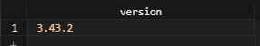

# SQLite SQLITE VERSION #########################

[Файл с запросами][querys]   
[Оригинальная статья][origin]

[querys]: ./querys.sql
[origin]: https://www.sqlitetutorial.net/sqlite-functions/sqlite_version/

## Обзор ##############################

Функция `sqlite_verison()` возвращает текстовое представление номера версии билиотеки SQLite, например `3.8.10`

Функция `sqlite_verioson` является обёрткой `sqlite3_libversion()` С.

## Синтаксис

~~~ SQL ~~~~~~~~~~~~~~~~~~~~~~~~~~~~~~~
sqlite_version()
~~~~~~~~~~~~~~~~~~~~~~~~~~~~~~~~~~~~~~~

## Аргументы 

Функция не принимает аргументов

## Тип возвращаемого значения

TEXT

## Примеры

Следующее выражение возвращает текущую версию библиотеки SQLite:

~~~ SQL ~~~~~~~~~~~~~~~~~~~~~~~~~~~~~~~
SELECT sqlite_version() AS version;
~~~~~~~~~~~~~~~~~~~~~~~~~~~~~~~~~~~~~~~

---------------------------------------

Предидущее руководство < [SQLite ROUND][prev]  
Следующее руководство > [SQLite COALESCE][next]

[prev]: ../60_Round/translate.md
[next]: ../62_Coalesce/translate.md