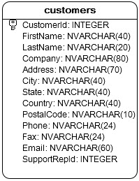
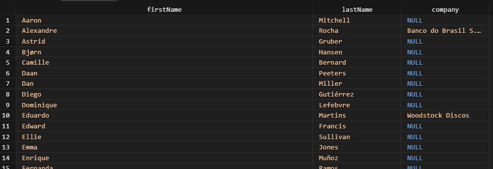
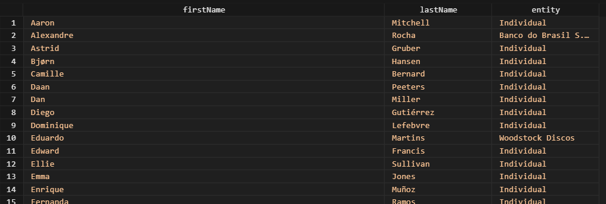
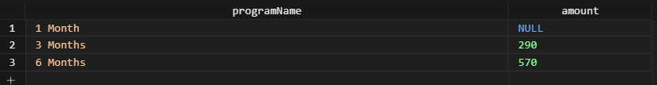
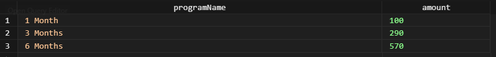

# SQLite COALESCE #########################

[Файл с запросами][querys]   
[Оригинальная статья][origin]

[querys]: ./querys.sql
[origin]: https://www.sqlitetutorial.net/sqlite-functions/sqlite-coalesce/

## Обзор ##############################

В этом руководстве вы изучите, как использовать функцию `COALESCE` для обработки значений `NULL`.

## Знакомство с функцией SQLite `COALESCE`

Функция `COALESCE` принимает два или более аргумента и возвращает первый не null-евой аргумент. Ниже представлен синтаксис функции:

~~~ SQL ~~~~~~~~~~~~~~~~~~~~~~~~~~~~~~~
COALESCE( parameter1, parameter2, ... );
~~~~~~~~~~~~~~~~~~~~~~~~~~~~~~~~~~~~~~~

Если все аргументы равны `NULL`, функция `COALESCE` вернет `NULL`.

Функция `COALESCE` эквивалентна функции `NVL` в Oracle или `IFNULL` в MySQL.

Посмотрите следующий пример:

~~~ SQL ~~~~~~~~~~~~~~~~~~~~~~~~~~~~~~~
SELECT COALESCE(10, 20); -- return 10
SELECT COALESCE(NULL, 20, 10); -- return 20
~~~~~~~~~~~~~~~~~~~~~~~~~~~~~~~~~~~~~~~

На практике, функция `COALESCE` используется как заменитель значения по умолчанию для значений `NULL`.

## Примеры функции SQLite `COALESCE`

Посмотрите следующую таблицу `customers` из тестовой БД:

Следующий запрос возвращает `firstName`, `lastName` и `company`:

~~~ SQL ~~~~~~~~~~~~~~~~~~~~~~~~~~~~~~~
SELECT 
  firstName,
  lastName,
  company
FROM customers
ORDER BY firstName;
~~~~~~~~~~~~~~~~~~~~~~~~~~~~~~~~~~~~~~~

Информация о компании в таблице `customers` содержит значения `NULL`.

Вы можете использовать функцию `COALESCE` для замещения значений `NULL`, например, на значение `Individual`:

~~~ SQL ~~~~~~~~~~~~~~~~~~~~~~~~~~~~~~~
SELECT 
  firstName,
  lastName,
  COALESCE(company, 'Individual') entity
FROM customers
ORDER BY firstName;
~~~~~~~~~~~~~~~~~~~~~~~~~~~~~~~~~~~~~~~

Давайте посмотрим другой пример, который мы обычно встречаем в реальных ситуациях.

1. Создадим новую таблицу под названием `memberships`, которая хранит имя программы, цену и скидку:

~~~ SQL ~~~~~~~~~~~~~~~~~~~~~~~~~~~~~~~
CREATE TABLE IF NOT EXISTS memberships (
  membershipId INT PRIMARY KEY,
  programName TEXT NOT NULL,
  netPrice NUMERIC NOT NULL,
  discount NUMERIC
);
~~~~~~~~~~~~~~~~~~~~~~~~~~~~~~~~~~~~~~~

2. Вставим некоторые данные со значение `NULL`:

~~~ SQL ~~~~~~~~~~~~~~~~~~~~~~~~~~~~~~~
INSERT INTO memberships (programName, netPrice, discount)
VALUES 
  ('1 Month', 100, null),
  ('3 Months', 300, 10),
  ('6 Months', 600, 30);
~~~~~~~~~~~~~~~~~~~~~~~~~~~~~~~~~~~~~~~

3. Выберем данные из таблици; посчитаем количество платы, вычев скидку из цены.

~~~ SQL ~~~~~~~~~~~~~~~~~~~~~~~~~~~~~~~
SELECT 
  programName,
  (netPrice - discount) AS amount
FROM memberships;
~~~~~~~~~~~~~~~~~~~~~~~~~~~~~~~~~~~~~~~

Количество платы за 1 месяц - `NULL`. Это произошло, потому что значение `discount` - `NULL`. Чтобы избежать этой ошибки, используется функция `COALESCE`:

~~~ SQL ~~~~~~~~~~~~~~~~~~~~~~~~~~~~~~~
SELECT 
  programName,
  (netPrice - COALESCE(discount, 0)) AS amount
FROM memberships;
~~~~~~~~~~~~~~~~~~~~~~~~~~~~~~~~~~~~~~~

---------------------------------------

Предидущее руководство < [SQLite SQLITE_VERSION][prev]  
Следующее руководство > [SQLite IFNULL][next]

[prev]: ../61_SqliteVersion/translate.md
[next]: ../63_IfNull/translate.md