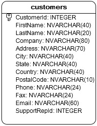
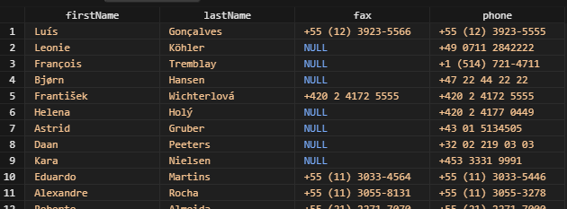

# SQLite IFNULL #########################

[Файл с запросами][querys]   
[Оригинальная статья][origin]

[querys]: ./querys.sql
[origin]: https://www.sqlitetutorial.net/sqlite-functions/sqlite-ifnull/

## Обзор ##############################

Функция SQLite `IFNULL` принимает два аргумента и возвращает первый не null-евой аргумент. Если оба аргумента `NULL`, функция вертет `NULL`.

## Синтаксис

Следующее выражение показывает синтаксис функции `IFNULL`:

~~~ SQL ~~~~~~~~~~~~~~~~~~~~~~~~~~~~~~~
IFNULL( parameter_1, parameter_2 );
~~~~~~~~~~~~~~~~~~~~~~~~~~~~~~~~~~~~~~~

## Аргументы

Функция `IFNULL` принимает ровно два рагумента.

Функция `IFNULL` эквивалентна функции `COALESCE`, но принимает только два аргумента. Функция `COALESCE` может имет дольше двух аргументав.

## Тип возвращаемого значения

Функция `IFNULL` возвращает тип аргумента или `NULL`.

## Примеры

Посмотрим таблицу `customers` тестовой БД.

Слудующий запрос выводит Имя, Фамилию, Факс и телефон клиентов.

~~~ SQL ~~~~~~~~~~~~~~~~~~~~~~~~~~~~~~~
SELECT
  firstName,
  lastName,
  fax,
  phone
FROM
  customers;
~~~~~~~~~~~~~~~~~~~~~~~~~~~~~~~~~~~~~~~

Много клиентов не имеют номера факса. В этом случае мы можем использовать функцию `IFNULL` для возврата номера факса, если он доступен или номера телефона, есил факс не доступен:

~~~ SQL ~~~~~~~~~~~~~~~~~~~~~~~~~~~~~~~
SELECT 
  firstName,
  lastName,
  IFNULL( fax, 'Call:' || phone ) fax
FROM
  customers
ORDER BY firstName;
~~~~~~~~~~~~~~~~~~~~~~~~~~~~~~~~~~~~~~~

---------------------------------------

Предидущее руководство < [SQLite COALESCE][prev]  
Следующее руководство > [SQLite IIF][next]

[prev]: ../62_Coalesce/translate.md
[next]: ../64_IIf/translate.md