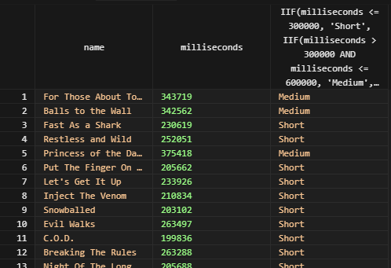

# SQLite IIF #########################

[Файл с запросами][querys]   
[Оригинальная статья][origin]

[querys]: ./querys.sql
[origin]: https://www.sqlitetutorial.net/sqlite-functions/sqlite-iif/

## Обзор ##############################

В этом руководстве вы изучите как использовать функцию `IIF()`, которая позволяет добавлять логику ветвлений в запросы.

## Знакомство с функцией `IIF()`

Функция `IIF()` представлена с версии `3.32.0`. Ниже показан синтаксис `IIF()`:

~~~ SQL ~~~~~~~~~~~~~~~~~~~~~~~~~~~~~~~
IIF(expression, true_expression, false_expression);
~~~~~~~~~~~~~~~~~~~~~~~~~~~~~~~~~~~~~~~

Здесь `IIF()` сначала вычисляет `expression`. Если результат `true`, `IIF()` возвращает значение `true_expression`. В противном случае возвращает результат `false_expression`.

Функция `IIF()` эквивалентна выражению `CASE`:

~~~ SQL ~~~~~~~~~~~~~~~~~~~~~~~~~~~~~~~
CASE
  WHEN expression
    THEN true_expression
  ELSE
    false_expression
END;
~~~~~~~~~~~~~~~~~~~~~~~~~~~~~~~~~~~~~~~

На практике, функция `IIF()` добавляет ветвление для более гибких запросов.

## Примеры `IIF()`

Давайте приведем пример `IIF()`.

### 1) Простой пример функции `IIF()`

Ниже представлен запрос, который показывает работу функции в простом запросе:

~~~ SQL ~~~~~~~~~~~~~~~~~~~~~~~~~~~~~~~
SELECT IIF(1 < 2, 'Yes', 'No') result;
~~~~~~~~~~~~~~~~~~~~~~~~~~~~~~~~~~~~~~~

Вывод:

### 2) Пример функции `IIF()` для класификации информации

Возмем таблицу `tracks` из тестовой базы данных:

Следующий запрос использует `IIF()` для класификации треков из таблицы по из длинне:

~~~ SQL ~~~~~~~~~~~~~~~~~~~~~~~~~~~~~~~
SELECT
  name,
  milliseconds,
  IIF(milliseconds <= 300000, 'Short',
    IIF(milliseconds > 300000 AND milliseconds <= 600000, 'Medium',
      IIf(milliseconds > 600000, 'Long', 'N/A')
    )
  )
FROM
  tracks;
~~~~~~~~~~~~~~~~~~~~~~~~~~~~~~~~~~~~~~~

---------------------------------------

Предидущее руководство < [SQLite IFNULL][prev]  
Следующее руководство > [SQLite NULLIF][next]

[prev]: ../63_IfNull/translate.md
[next]: ../65_NullIf/translate.md