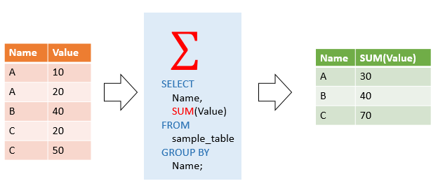
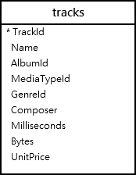
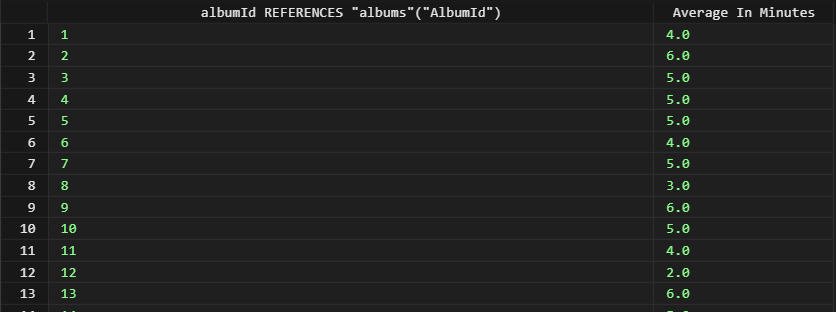
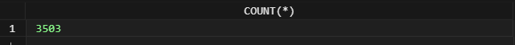
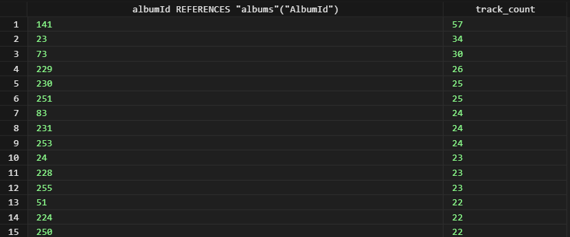
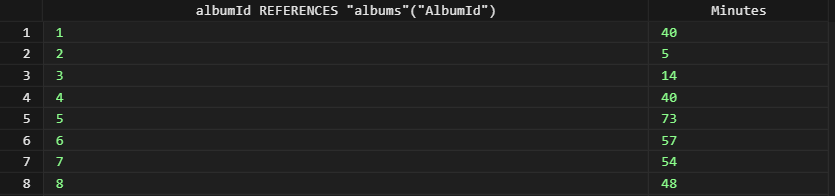
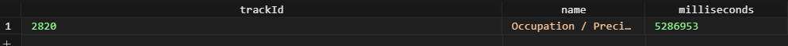
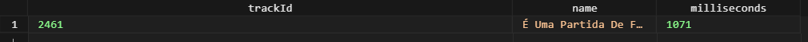
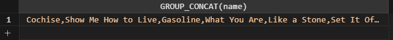

# SQLite Aggregate Functions #########################

[Файл с запросами][querys]   
[Оригинальная статья][origin]

[querys]: ./querys.sql
[origin]: https://www.sqlitetutorial.net/sqlite-aggregate-functions/

## Обзор ##############################

В этом руководстве вы узнаете, как, с помощью агрегатных функций SQLite найти максимальное, минимальное, среднее, сумму и количество значений набора.

## Агрегатные функции

Агрегатные функции применяются к набору строк и возвращают единый результат. Обычно они используют объединение `GROUP BY` и `HAVING` в выражении `SELECT`.

SQLite поддерживает следующие функции агрегации:

- `AVG()` - возвращает среднее значение
- `COUNT()` - возвращает количество строк, которые удовлетворяют указанному условию
- `MAX()` - возвращает максимальное значение из группы
- `MIN()` - возвращает минимальное значение из группы
- `SUM()` - возвращает сумму значений
- `GROUP_CONCAT(expression, separator)` - возвращает строку, которая является конкатенацией всех не nullевых значений `expression` разделенных `separator`.

## Синтаксис

Ниже приведен синтаксис вызова функции агрегации кроме функции `GROUP_CONCAT()`:

~~~ SQL ~~~~~~~~~~~~~~~~~~~~~~~~~~~~~~~
aggregate_function (DISTINCT | ALL expression)
~~~~~~~~~~~~~~~~~~~~~~~~~~~~~~~~~~~~~~~

- Укажите название функции агрегации, например `AVG`, `SUM` или `COUNT`.
- Укажите выражение, к которому будет применена функция

Инструкция `DISTINCT` говорит о том, что функция будет брать только уникальные значения, в то время как инструкция `ALL`, что будут братся все значения, включая дубликаты.

Следующая картинка показывает работу функции `SUM()`:

## Пример работы функции агрегации

Мы будем использовать таблицу `tracks` тестовой БД для демонстрации:

### AVG()

Следующее выражение находит среднюю длинну всех треков каждого альбома:

~~~ SQL ~~~~~~~~~~~~~~~~~~~~~~~~~~~~~~~
SELECT
  albumId,
  ROUND(AVG(milliseconds) / 60000, 0) "Average In Minutes"
FROM
  tracks
GROUP BY
  albumId;
~~~~~~~~~~~~~~~~~~~~~~~~~~~~~~~~~~~~~~~

- `GROUP BY` разделяет треки на группы по id альбома.
- `AVG` применяется к каждой группе, и вычисляет длинну треков в каждой группе

### COUNT()

Следующее выражение возвращает количество строк из таблицы `tracks`:

~~~ SQL ~~~~~~~~~~~~~~~~~~~~~~~~~~~~~~~
SELECT
  COUNT(*)
FROM
  tracks;
~~~~~~~~~~~~~~~~~~~~~~~~~~~~~~~~~~~~~~~

Для поиска альбомов и соответствующего количества треков в них, используем следующее выражение:

~~~ SQL ~~~~~~~~~~~~~~~~~~~~~~~~~~~~~~~
SELECT
  albumId,
  COUNT(trackId) track_count
FROM
  tracks
GROUP BY
  albumId
ORDER BY
  track_count DESC;
~~~~~~~~~~~~~~~~~~~~~~~~~~~~~~~~~~~~~~~

### SUM()

Следующее выражение использует функцию `SUM()` для вычисления длинны всех треков в альбоме в минутах:

~~~ SQL ~~~~~~~~~~~~~~~~~~~~~~~~~~~~~~~
SELECT
  albumId,
  SUM(milliseconds) / 60000 "Minutes"
FROM
  tracks
GROUP BY
  albumId;
~~~~~~~~~~~~~~~~~~~~~~~~~~~~~~~~~~~~~~~

### MAX()

Для поиска самого длинного трека используем функцию `MAX()` как показано ниже:

~~~ SQL ~~~~~~~~~~~~~~~~~~~~~~~~~~~~~~~
SELECT
  MAX(milliseconds) / 60000 "Minutes"
FROM
  tracks;
~~~~~~~~~~~~~~~~~~~~~~~~~~~~~~~~~~~~~~~

В случае, когда требуется найти терки, с самым длинным временем, используем подзапрос:

~~~ SQL ~~~~~~~~~~~~~~~~~~~~~~~~~~~~~~~
SELECT
  trackId,
  name,
  milliseconds
FROM
  tracks
WHERE
  milliseconds = (
    SELECT
      MAX(milliseconds)
    FROM
      tracks
  );
~~~~~~~~~~~~~~~~~~~~~~~~~~~~~~~~~~~~~~~

В этом примере внешний запрос вернет трек, чья продолжительность равна продолжительности, возвращенной подзапросом.

### MIN()

Аналогично предыдущиему примеру, найдем трек с минимальным временем:

~~~ SQL ~~~~~~~~~~~~~~~~~~~~~~~~~~~~~~~
SELECT
  trackId,
  name,
  milliseconds
FROM
  tracks
WHERE
  milliseconds = (
    SELECT
      MIN(milliseconds)
    FROM
      tracks
  );
~~~~~~~~~~~~~~~~~~~~~~~~~~~~~~~~~~~~~~~

### GROUP_CONCAT()

Следующее выражение использует функцию `GROUP_CONCAT()` чтобы вернуть, разделенный запятыми список имен треков альбома с id 10:

~~~ SQL ~~~~~~~~~~~~~~~~~~~~~~~~~~~~~~~
SELECT
  GROUP_CONCAT(name)
FROM
  tracks
WHERE
  albumId = 10;
~~~~~~~~~~~~~~~~~~~~~~~~~~~~~~~~~~~~~~~

---------------------------------------

Предидущее руководство < [SQLite NULLIF][prev]  
Следующее руководство > [SQLite AVG][next]

[prev]: ../65_NullIf/translate.md
[next]: ../67_AVG/translate.md