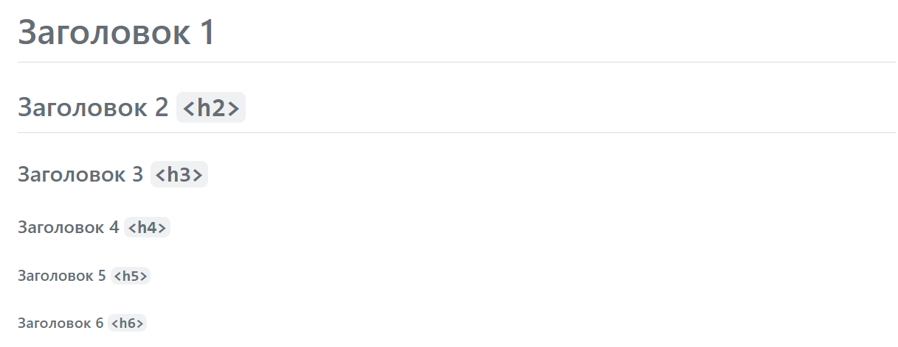

# Шпаргалка по markdown ##############################

## Полезные ссылки

[Википедия][wiki]

[Официальный сайт (синтаксис)][daring fireball]

[Шпаргалка от скилбокса][skillbox]

[Диалект гитхаба][GitHub Flavored Markdown Spec]

[Расширенный диалект][CommonMark Spec]

[wiki]: https://ru.wikipedia.org/wiki/Markdown
[daring fireball]: https://daringfireball.net/projects/markdown/syntax
[skillbox]: https://skillbox.ru/media/code/yazyk-razmetki-markdown-shpargalka-po-sintaksisu-s-primerami/

[GitHub Flavored Markdown Spec]: https://github.github.com/gfm/

[CommonMark Spec]: https://spec.commonmark.org/0.30/

## Встроеный (Inline) HTML ###########################

### Block-level ######################################
~~~~~~~~~~~~~~~~~~~~~~~~~~~~~~~~~~~~~~~~~~~ Markdown ~
<table>
  <tr>
    <th>Столбец 1</th>
    <th>Столбец 2</th>
    <th>Столбец 3</th>
  </tr>
  <tr>
    <td>Ячейка</td>
    <!-- Не обрабатывается внутри *блочных* тэгов-->
    <td>*Курсивная ячейка*</td>
    <td>__Жирная ячейка__</td>
  </tr>
</table>
<!-- Должен быть пробел -->
~~~~~~~~~~~~~~~~~~~~~~~~~~~~~~~~~~~~~~~~~~~~~~~~~~~~~~

> <table>
>  <tr>
>    <th>Столбец 1</th>
>    <th>Столбец 2</th>
>    <th>Столбец 3</th>
>  </tr>
>  <tr>
>    <td>Ячейка</td>
>    <!-- Не обрабатывается внутри *блочных* тэгов -->
>    <td>*Курсивная ячейка*</td>
>    <td>__Жирная ячейка__</td>
>  </tr>
> </table>

### Span-level #######################################
~~~~~~~~~~~~~~~~~~~~~~~~~~~~~~~~~~~~~~~~~~~ Markdown ~
span
<cite>cite</cite>
<del>**del**</del> <!-- Обрабатывается внутри строчных тэгов -->
~~~~~~~~~~~~~~~~~~~~~~~~~~~~~~~~~~~~~~~~~~~~~~~~~~~~~~

> span
> <cite>cite</cite>
> <del>**del**</del>

## Абзацы и перенос строки ###########################

### Фармирование абзаца ##############################
~~~~~~~~~~~~~~~~~~~~~~~~~~~~~~~~~~~~~~~~~~~ Markdown ~
Абзац 1

Абзац 2
продолжение абзаца 2
~~~~~~~~~~~~~~~~~~~~~~~~~~~~~~~~~~~~~~~~~~~~~~~~~~~~~~

> Абзац 1
> 
> Абзац 2
> продолжение абзаца 2

### Перенос строки ###################################
~~~~~~~~~~~~~~~~~~~~~~~~~~~~~~~~~~~~~~~~~~~ Markdown ~
Перенос пробелом••
Перенос обратным слэшом\
Перенос тэгом   перенос
~~~~~~~~~~~~~~~~~~~~~~~~~~~~~~~~~~~~~~~~~~~~~~~~~~~~~~

> Перенос пробелом  
> Перенос обратным слэшом\
> Перенос тэгом   перенос

## Заголовки #########################################

### Setext-style
~~~~~~~~~~~~~~~~~~~~~~~~~~~~~~~~~~~~~~~~~~~ Markdown ~
Заголовок 1 `<h1>`
=
<!-- 1 и более симолов -->
Заголовок 2 `<h2>`
-------------
~~~~~~~~~~~~~~~~~~~~~~~~~~~~~~~~~~~~~~~~~~~~~~~~~~~~~~

> 

### Atx-style ########################################
~~~~~~~~~~~~~~~~~~~~~~~~~~~~~~~~~~~~~~~~~~~ Markdown ~
# Заголовок 1 
## Заголовок 2 `<h2>` ################################
### Заголовок 3 `<h3>` ###
#### Заголовок 4 `<h4>` #
##### Заголовок 5 `<h5>`
###### Заголовок 6 `<h6>`
~~~~~~~~~~~~~~~~~~~~~~~~~~~~~~~~~~~~~~~~~~~~~~~~~~~~~~

> 

## Цитаты ############################################

~~~~~~~~~~~~~~~~~~~~~~~~~~~~~~~~~~~~~~~~~~~ Markdown ~
> Цитаты можно писать как в несколько строк
> используя символ > так и в сокращенную запись
> 
> Второй параграф

> Это *ленивая* цитата. 
Просто заполнение текста

> В цитате может быть вложеность
> > Это подцитата
> Вторая строка подцитаты
>
> Могут быть другие элементы 
> - Списки
> - `Код`
> - Заголовки (не вставляю код, чтобы не портить оглавление)
~~~~~~~~~~~~~~~~~~~~~~~~~~~~~~~~~~~~~~~~~~~~~~~~~~~~~~

> Цитаты можно писать как в несколько строк
> используя символ > так и в сокращенную запись
> 
> Второй параграф

> Это *ленивая* цитата. 
Просто заполнение текста

> В цитате может быть вложеность
> > Это подцитата
> Вторая строка подцитаты
>
> Могут быть другие элементы 
> - Списки
> - `Код`
> - Заголовки (не вставляю код, чтобы не портить оглавление)

## Списки ############################################

~~~~~~~~~~~~~~~~~~~~~~~~~~~~~~~~~~~~~~~~~~~ Markdown ~
* Списки могут начинаться с разных символов
+ 
~~~~~~~~~~~~~~~~~~~~~~~~~~~~~~~~~~~~~~~~~~~~~~~~~~~~~~

* Списки могут начинаться с разных символов
+ Плючик
- Тирэ

